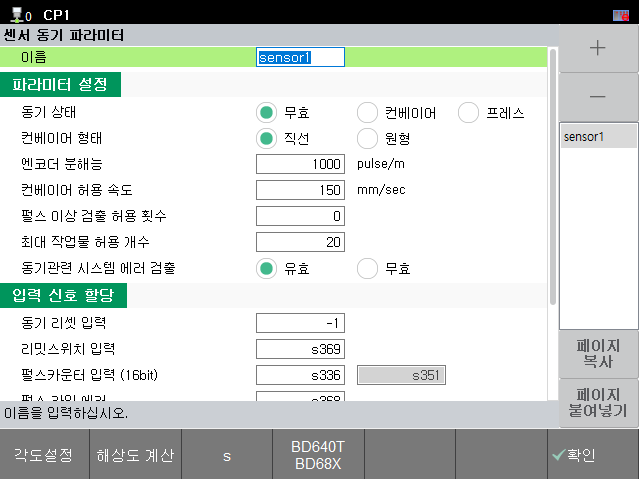
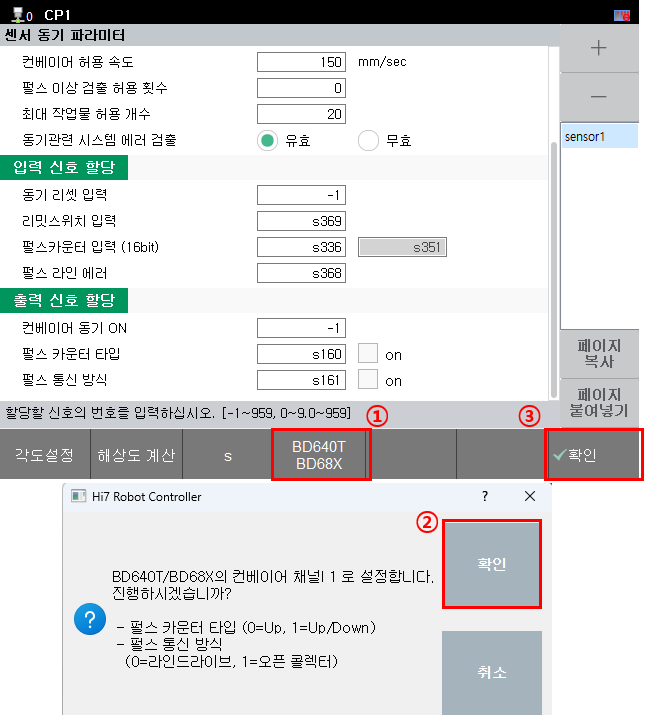
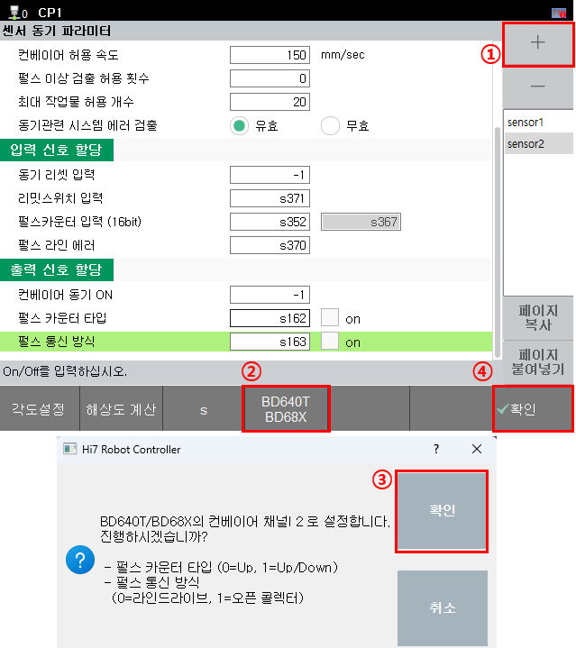
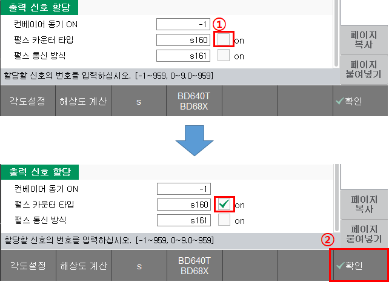

# 2.5. 센서 동기 설정


컨베이어 엔코더 인터페이스를 사용하지 않을 경우는 "센서 동기" 설정을 진행하지 않아도 됩니다.


BD682의 컨베이어 엔코더 인터페이스 사용할 경우 "센서 동기" 설정이 필요합니다. 

**- 메뉴 위치: [시스템] - [4: 응용 파라미터] - [4: 센서 동기]**

 
<그림 1. 센서 동기 설정 UI>  

'파라미터 설정'의 '동기 상태' 항목을 '컨베이어'로 설정하고 '입력 신호 할당', '출력 신호 할당'을 정상적으로 설정해야 컨베이어 엔코더 인터페이스를 사용할 수 있습니다.

 
<그림 2. 동기 상태를 컨베이어로 설정> 

'파라미터 설정'에 대한 세부 정보는 "[로봇제어기 기능설명서 - 센서 동기 (센서 동기 파라미터)](https://hrbook-hrc.web.app/#/view/doc-sensor-sync/korean/3-user-interface/3-3-sensor-sync-parameter)"를 참고하시기 바랍니다.

 
BD682의 컨베이어 엔코더 인터페이스는 시스템 입출력에 연동되므로 입출력 신호 할당이 필요합니다. 

아래 그림과 같이 UI 밑에 위치한 **[BD640T BD68X] 버튼**을 누르면 지정된 입출력 번호를 입력해 줍니다. 그리고 최종적으로 **[v확인] 버튼**을 누르면 설정을 적용할 수 있습니다.

 
<그림 3. 채널1 시스템 입출력 설정>  

 
<그림 4. 채널2 시스템 입출력 설정>  

추가적으로 펄스 카운터 타입, 펄스 통신 방식(엔코더 종류)을 선택할 수 있습니다. 아래의 표 내용을 참고하시기 바랍니다.
 

<표 1. 펄스 카운터 타입, 펄스 통신 방식(엔코더 종류) 정보>

<table>
<thead>
    <tr>
        <th style="width: 20px; text-align: center;">
            No.
        </th>
        <th style="width: 110px; text-align: center;">
            출력 신호 할당
        </th>
        <th style="width: 30px; text-align: center;">
            ON/OFF
        </th>
        <th style="width: 250px; text-align: center;">
            비고
        </th>
    </tr>
</thead>
<tbody>
    <tr>
        <td rowspan="2" style="text-align: center;">
            <strong>1</strong>
        </td>
        <td rowspan="2" style="text-align: center;">
            펄스 카운터 타입
        </td>
        <td style="text-align: center;">
            ON (1)
        </td>
        <td> 
            Up / Down 카운터 방식
        </td>
    </tr>        
        <td style="text-align: center;">
            OFF (0)
        </td>
        <td> 
            Up 카운터 방식 (초기값)
        </td>
    </tr>
        <tr>
        <td rowspan="2" style="text-align: center;">
            <strong>2</strong>
        </td>
        <td rowspan="2" style="text-align: center;">
            펄스 통신 방식 
            (엔코더 종류)
        </td>
        <td style="text-align: center;">
            ON (1)
        </td>
        <td> 
            오픈 콜렉터 엔코더
        </td>
    </tr>        
        <td style="text-align: center;">
            OFF (0)
        </td>
        <td> 
            라인드라이브 엔코더 (초기값)
        </td>
    </tr>
</tbody>
</table>

 

아래 그림처럼 체크박스를 클릭하면 ON으로 입력할 수 있습니다. 
적용을 위해서는 반드시 **[v확인] 버튼**을 눌러야 합니다.

 
<그림 5. 펄스 카운터 타입 ON 적용> 

세부적인 내용은 "[로봇제어기 기능설명서 - 센서 동기](https://hrbook-hrc.web.app/#/view/doc-sensor-sync/korean/README)"의 컨베이어 관련 부분을 참고하시기 바랍니다.
