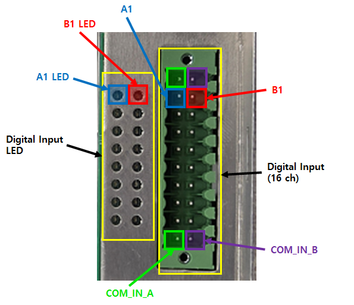

# 2.1. 하드웨어 정보

사용자 DIO (BD681)를 사용하여 각종 장치들과 디지털 입출력 포트를 통하여 연계 또는 구성이 가능합니다. 
또한 확장 DIO (BD682)를 통해 디지털 입출력 포트 추가 및 컨베이어 시스템과의 동기화를 할 수 있습니다. 
기본적인 보드의 하드웨어 구성은 아래와 같습니다. 

 
<그림 1. 사용자 DIO (BD681)>

 

 
<그림 2. 사용자 DIO (BD681) 커넥터>

 

 
<그림 3. 확장 DIO (BD682)>

 

 
<그림 4. 확장 DIO (BD682) 커넥터>

 

# 2.1.1. 디지털 입력

다음의 그림과 표는 디지털 입력용 터미널 블록의 핀 구성을 나타낸 것입니다. 
각 터미널 블록은 16개의 입력 신호를 받을 수 있으며, 용도에 따라 NPN, PNP 타입의 입력을 받을 수 있습니다. 
BD682를 추가 장착을 하게 되면, 디지털 입력 16pt가 추가 됩니다.  

 
<그림 5. 사용자 DIO (BD681) 디지털 입력 커넥터>


1번 핀과 10번 핀, 11번 핀과 20번 핀은 보드 내부에서 연결되어 있습니다.


<표 1. 사용자 DIO (BD681) 디지털 입력 커넥터>

<table>
<thead>
    <tr>
        <th style="width: 50px; text-align: center;">핀 번호</th>
        <th style="width: 50px; text-align: center;">신호명</th>
        <th style="width: 110px; text-align: center;">신호 설명</th>        
        <th style="width: 50px; text-align: center;">핀 번호</th>
        <th style="width: 50px; text-align: center;">신호명</th>
        <th style="width: 110px; text-align: center;">신호 설명</th>
    </tr>
</thead>
<tbody>
    <tr>
        <td style="text-align: center;">1</td>
        <td style="text-align: center;">
            <strong> COM_IN_A </strong>
        </td>
        <td style="text-align: center;">
            COM 신호 
            (1 ~ 8)
        </td>
        <td style="text-align: center;">11</td>
        <td style="text-align: center;">
            <strong> COM_IN_B </strong>
        </td>
        <td style="text-align: center;">
            COM 신호 
            (9~16)
        </td>
    </tr>
    <tr>
        <td style="text-align: center;">2</td>
        <td style="text-align: center;">
            <strong> A1 </strong>
        </td>
        <td style="text-align: center;">디지털 입력 1</td>
        <td style="text-align: center;">12</td>
        <td style="text-align: center;">
            <strong> B1 </strong>
        </td>
        <td style="text-align: center;">디지털 입력 9</td>
    </tr>
    <tr>
        <td style="text-align: center;">3</td>
        <td style="text-align: center;">A2</td>
        <td style="text-align: center;">디지털 입력 2</td>
        <td style="text-align: center;">13</td>
        <td style="text-align: center;">B2</td>
        <td style="text-align: center;">디지털 입력 10</td>
    </tr>
    <tr>
        <td style="text-align: center;">4</td>
        <td style="text-align: center;">A3</td>
        <td style="text-align: center;">디지털 입력 3</td>
        <td style="text-align: center;">14</td>
        <td style="text-align: center;">B3</td>
        <td style="text-align: center;">디지털 입력 11</td>
    </tr>
    <tr>
        <td style="text-align: center;">5</td>
        <td style="text-align: center;">A4</td>
        <td style="text-align: center;">디지털 입력 4</td>
        <td style="text-align: center;">15</td>
        <td style="text-align: center;">B4</td>
        <td style="text-align: center;">디지털 입력 12</td>
    </tr>
    <tr>
        <td style="text-align: center;">6</td>
        <td style="text-align: center;">A5</td>
        <td style="text-align: center;">디지털 입력 5</td>
        <td style="text-align: center;">16</td>
        <td style="text-align: center;">B5</td>
        <td style="text-align: center;">디지털 입력 13</td>
    </tr>
    <tr>
        <td style="text-align: center;">7</td>
        <td style="text-align: center;">A6</td>
        <td style="text-align: center;">디지털 입력 6</td>
        <td style="text-align: center;">17</td>
        <td style="text-align: center;">B6</td>
        <td style="text-align: center;">디지털 입력 14</td>
    </tr>
    <tr>
        <td style="text-align: center;">8</td>
        <td style="text-align: center;">A7</td>
        <td style="text-align: center;">디지털 입력 7</td>
        <td style="text-align: center;">18</td>
        <td style="text-align: center;">B7</td>
        <td style="text-align: center;">디지털 입력 15</td>
    </tr>
    <tr>
        <td style="text-align: center;">9</td>
        <td style="text-align: center;">A8</td>
        <td style="text-align: center;">디지털 입력 8</td>
        <td style="text-align: center;">19</td>
        <td style="text-align: center;">B8</td>
        <td style="text-align: center;">디지털 입력 16</td>
    </tr>
    <tr>
        <td style="text-align: center;">10</td>
        <td style="text-align: center;">
            <strong> COM_IN_A </strong>
        </td>
        <td style="text-align: center;">
            COM 신호 
            (1~8)
        </td>
        <td style="text-align: center;">20</td>
        <td style="text-align: center;">
            <strong> COM_IN_B </strong>
        </td>
        <td style="text-align: center;">
            COM 신호 
            (9~16)
        </td>
    </tr>
</tbody>
</table>
 

확장 DIO (BD682) 추가 장착 시 핀맵 은 아래와 같습니다. 

 
<그림 6. 확장 DIO (BD682) 디지털 입력 커넥터>


1번 핀과 10번 핀, 11번 핀과 20번 핀은 보드 내부에서 연결되어 있습니다.


<표 2. 확장 DIO (BD682) 디지털 입력 커넥터>

<table>
<thead>
    <tr>
        <th style="width: 50px; text-align: center;">핀 번호</th>
        <th style="width: 50px; text-align: center;">신호명</th>
        <th style="width: 110px; text-align: center;">신호 설명</th>        
        <th style="width: 50px; text-align: center;">핀 번호</th>
        <th style="width: 50px; text-align: center;">신호명</th>
        <th style="width: 110px; text-align: center;">신호 설명</th>
    </tr>
</thead>
<tbody>
    <tr>
        <td style="text-align: center;">1</td>
        <td style="text-align: center;">
            <strong> COM_IN_A </strong>
        </td>
        <td style="text-align: center;">
            COM 신호 
            (1~8)
        </td>
        <td style="text-align: center;">11</td>
        <td style="text-align: center;">
            <strong> COM_IN_B </strong>
        </td>
        <td style="text-align: center;">
            COM 신호 
            (9~16)
        </td>
    </tr>
    <tr>
        <td style="text-align: center;">2</td>
        <td style="text-align: center;">
            <strong> A9 </strong>
        </td>
        <td style="text-align: center;">디지털 입력 1</td>
        <td style="text-align: center;">12</td>
        <td style="text-align: center;">
            <strong> B9 </strong>
        </td>
        <td style="text-align: center;">디지털 입력 9</td>
    </tr>
    <tr>
        <td style="text-align: center;">3</td>
        <td style="text-align: center;">A10</td>
        <td style="text-align: center;">디지털 입력 2</td>
        <td style="text-align: center;">13</td>
        <td style="text-align: center;">B10</td>
        <td style="text-align: center;">디지털 입력 10</td>
    </tr>
    <tr>
        <td style="text-align: center;">4</td>
        <td style="text-align: center;">A11</td>
        <td style="text-align: center;">디지털 입력 3</td>
        <td style="text-align: center;">14</td>
        <td style="text-align: center;">B11</td>
        <td style="text-align: center;">디지털 입력 11</td>
    </tr>
    <tr>
        <td style="text-align: center;">5</td>
        <td style="text-align: center;">A12</td>
        <td style="text-align: center;">디지털 입력 4</td>
        <td style="text-align: center;">15</td>
        <td style="text-align: center;">B12</td>
        <td style="text-align: center;">디지털 입력 12</td>
    </tr>
    <tr>
        <td style="text-align: center;">6</td>
        <td style="text-align: center;">A13</td>
        <td style="text-align: center;">디지털 입력 5</td>
        <td style="text-align: center;">16</td>
        <td style="text-align: center;">B13</td>
        <td style="text-align: center;">디지털 입력 13</td>
    </tr>
    <tr>
        <td style="text-align: center;">7</td>
        <td style="text-align: center;">A14</td>
        <td style="text-align: center;">디지털 입력 6</td>
        <td style="text-align: center;">17</td>
        <td style="text-align: center;">B14</td>
        <td style="text-align: center;">디지털 입력 14</td>
    </tr>
    <tr>
        <td style="text-align: center;">8</td>
        <td style="text-align: center;">A15</td>
        <td style="text-align: center;">디지털 입력 7</td>
        <td style="text-align: center;">18</td>
        <td style="text-align: center;">B15</td>
        <td style="text-align: center;">디지털 입력 15</td>
    </tr>
    <tr>
        <td style="text-align: center;">9</td>
        <td style="text-align: center;">A16</td>
        <td style="text-align: center;">디지털 입력 8</td>
        <td style="text-align: center;">19</td>
        <td style="text-align: center;">B16</td>
        <td style="text-align: center;">디지털 입력 16</td>
    </tr>
    <tr>
        <td style="text-align: center;">10</td>
        <td style="text-align: center;">
            <strong> COM_IN_A </strong>
        </td>
        <td style="text-align: center;">
            COM 신호 
            (1~8)
        </td>
        <td style="text-align: center;">20</td>
        <td style="text-align: center;">
            <strong> COM_IN_B </strong>
        </td>
        <td style="text-align: center;">
            COM 신호 
            (9~16)
        </td>
    </tr>
</tbody>
</table>
 


디지털 입력의 NPN, PNP는 다음 표와 같이 COM 핀에 연결하는 전압을 통하여 설정할 수 있습니다.


<표 3. 디지털 입력 NPN, PNP 연결 정보>

<table>
<thead>
    <tr>
        <th style="width: 20px; text-align: center;">No.</th>
        <th style="width: 100px; text-align: center;">COM 핀 전압</th>
        <th style="width: 250px; text-align: center;">비고</th>
    </tr>
</thead>
<tbody>
    <tr>
        <td style="text-align: center;"><strong>1</strong></td>
        <td style="text-align: center;">24 V</td>
        <td> 
            NPN 입력 (Signal Active Low) 전압 사용
        </td>
    </tr>
        <td style="text-align: center;"><strong>2</strong></td>
        <td style="text-align: center;">0 V</td>
        <td> 
            PNP 입력 (Signal Active High) 전압 사용
        </td>
    </tr>
</tbody>
</table>

 
           
# 2.1.2. 디지털 출력

다음의 그림과 표는 디지털 출력용 터미널 블록의 핀 구성을 나타낸 것입니다. 
각 터미널 블록은 16개의 출력 신호를 받을 수 있으며, 용도에 따라 NPN, PNP 타입의 출력을 받을 수 있습니다. 
BD682를 추가 장착을 하게 되면, 디지털 출력 16pt가 추가 됩니다. 

 
<그림 7. 사용자 DIO (BD681) 디지털 출력 커넥터>


1번 핀과 10번 핀, 11번 핀과 20번 핀은 보드 내부에서 연결되어 있습니다.


<표 4. 사용자 DIO (BD681) 디지털 출력 커넥터>

<table>
<thead>
    <tr>
        <th style="width: 50px; text-align: center;">핀 번호</th>
        <th style="width: 50px; text-align: center;">신호명</th>
        <th style="width: 110px; text-align: center;">신호 설명</th>        
        <th style="width: 50px; text-align: center;">핀 번호</th>
        <th style="width: 50px; text-align: center;">신호명</th>
        <th style="width: 110px; text-align: center;">신호 설명</th>
    </tr>
</thead>
<tbody>
    <tr>
        <td style="text-align: center;">1</td>
        <td style="text-align: center;">
            <strong> COM_OUT_A </strong>
        </td>
        <td style="text-align: center;">
            COM 신호 
            (1 ~ 8)
        </td>
        <td style="text-align: center;">11</td>
        <td style="text-align: center;">
            <strong> COM_OUT_B </strong>
        </td>
        <td style="text-align: center;">
            COM 신호 
            (9~16)
        </td>
    </tr>
    <tr>
        <td style="text-align: center;">2</td>
        <td style="text-align: center;">
            <strong> A1 </strong>
        </td>
        <td style="text-align: center;">디지털 출력 1</td>
        <td style="text-align: center;">12</td>
        <td style="text-align: center;">
            <strong> B1 </strong>
        </td>
        <td style="text-align: center;">디지털 출력 9</td>
    </tr>
    <tr>
        <td style="text-align: center;">3</td>
        <td style="text-align: center;">A2</td>
        <td style="text-align: center;">디지털 출력 2</td>
        <td style="text-align: center;">13</td>
        <td style="text-align: center;">B2</td>
        <td style="text-align: center;">디지털 출력 10</td>
    </tr>
    <tr>
        <td style="text-align: center;">4</td>
        <td style="text-align: center;">A3</td>
        <td style="text-align: center;">디지털 출력 3</td>
        <td style="text-align: center;">14</td>
        <td style="text-align: center;">B3</td>
        <td style="text-align: center;">디지털 출력 11</td>
    </tr>
    <tr>
        <td style="text-align: center;">5</td>
        <td style="text-align: center;">A4</td>
        <td style="text-align: center;">디지털 출력 4</td>
        <td style="text-align: center;">15</td>
        <td style="text-align: center;">B4</td>
        <td style="text-align: center;">디지털 출력 12</td>
    </tr>
    <tr>
        <td style="text-align: center;">6</td>
        <td style="text-align: center;">A5</td>
        <td style="text-align: center;">디지털 출력 5</td>
        <td style="text-align: center;">16</td>
        <td style="text-align: center;">B5</td>
        <td style="text-align: center;">디지털 출력 13</td>
    </tr>
    <tr>
        <td style="text-align: center;">7</td>
        <td style="text-align: center;">A6</td>
        <td style="text-align: center;">디지털 출력 6</td>
        <td style="text-align: center;">17</td>
        <td style="text-align: center;">B6</td>
        <td style="text-align: center;">디지털 출력 14</td>
    </tr>
    <tr>
        <td style="text-align: center;">8</td>
        <td style="text-align: center;">A7</td>
        <td style="text-align: center;">디지털 출력 7</td>
        <td style="text-align: center;">18</td>
        <td style="text-align: center;">B7</td>
        <td style="text-align: center;">디지털 출력 15</td>
    </tr>
    <tr>
        <td style="text-align: center;">9</td>
        <td style="text-align: center;">A8</td>
        <td style="text-align: center;">디지털 출력 8</td>
        <td style="text-align: center;">19</td>
        <td style="text-align: center;">B8</td>
        <td style="text-align: center;">디지털 출력 16</td>
    </tr>
    <tr>
        <td style="text-align: center;">10</td>
        <td style="text-align: center;">
            <strong> COM_OUT_A </strong>
        </td>
        <td style="text-align: center;">
            COM 신호 
            (1~8)
        </td>
        <td style="text-align: center;">20</td>
        <td style="text-align: center;">
            <strong> COM_OUT_B </strong>
        </td>
        <td style="text-align: center;">
            COM 신호 
            (9~16)
        </td>
    </tr>
</tbody>
</table>
 

확장 DIO (BD682) 추가 장착 시 핀맵 은 아래와 같습니다. 

 
<그림 8. 확장 DIO (BD682) 디지털 출력 커넥터>


1번 핀과 10번 핀, 11번 핀과 20번 핀은 보드 내부에서 연결되어 있습니다.



BD682 의 디지털 출력 중, 12번 핀 ~ 19번 핀(디지털 출력 9 ~ 16)은 릴레이 출력 입니다.


<표 5. 확장 DIO (BD682) 디지털 출력 커넥터>

<table>
<thead>
    <tr>
        <th style="width: 50px; text-align: center;">핀 번호</th>
        <th style="width: 50px; text-align: center;">신호명</th>
        <th style="width: 110px; text-align: center;">신호 설명</th>        
        <th style="width: 50px; text-align: center;">핀 번호</th>
        <th style="width: 50px; text-align: center;">신호명</th>
        <th style="width: 110px; text-align: center;">신호 설명</th>
    </tr>
</thead>
<tbody>
    <tr>
        <td style="text-align: center;">1</td>
        <td style="text-align: center;">
            <strong> COM_OUT_A </strong>
        </td>
        <td style="text-align: center;">
            COM 신호 
            (1~8)
        </td>
        <td style="text-align: center;">11</td>
        <td style="text-align: center;">
            <strong> COM_OUT_B </strong>
        </td>
        <td style="text-align: center;">
            COM 신호 
            (9~16)
        </td>
    </tr>
    <tr>
        <td style="text-align: center;">2</td>
        <td style="text-align: center;">
            <strong> A9 </strong>
        </td>
        <td style="text-align: center;">디지털 출력 1</td>
        <td style="text-align: center;">12</td>
        <td style="text-align: center;">
            <strong> B9 </strong>
        </td>
        <td style="text-align: center;">디지털 출력 9</td>
    </tr>
    <tr>
        <td style="text-align: center;">3</td>
        <td style="text-align: center;">A10</td>
        <td style="text-align: center;">디지털 출력 2</td>
        <td style="text-align: center;">13</td>
        <td style="text-align: center;">B10</td>
        <td style="text-align: center;">디지털 출력 10</td>
    </tr>
    <tr>
        <td style="text-align: center;">4</td>
        <td style="text-align: center;">A11</td>
        <td style="text-align: center;">디지털 출력 3</td>
        <td style="text-align: center;">14</td>
        <td style="text-align: center;">B11</td>
        <td style="text-align: center;">디지털 출력 11</td>
    </tr>
    <tr>
        <td style="text-align: center;">5</td>
        <td style="text-align: center;">A12</td>
        <td style="text-align: center;">디지털 출력 4</td>
        <td style="text-align: center;">15</td>
        <td style="text-align: center;">B12</td>
        <td style="text-align: center;">디지털 출력 12</td>
    </tr>
    <tr>
        <td style="text-align: center;">6</td>
        <td style="text-align: center;">A13</td>
        <td style="text-align: center;">디지털 출력 5</td>
        <td style="text-align: center;">16</td>
        <td style="text-align: center;">B13</td>
        <td style="text-align: center;">디지털 출력 13</td>
    </tr>
    <tr>
        <td style="text-align: center;">7</td>
        <td style="text-align: center;">A14</td>
        <td style="text-align: center;">디지털 출력 6</td>
        <td style="text-align: center;">17</td>
        <td style="text-align: center;">B14</td>
        <td style="text-align: center;">디지털 출력 14</td>
    </tr>
    <tr>
        <td style="text-align: center;">8</td>
        <td style="text-align: center;">A15</td>
        <td style="text-align: center;">디지털 출력 7</td>
        <td style="text-align: center;">18</td>
        <td style="text-align: center;">B15</td>
        <td style="text-align: center;">디지털 출력 15</td>
    </tr>
    <tr>
        <td style="text-align: center;">9</td>
        <td style="text-align: center;">A16</td>
        <td style="text-align: center;">디지털 출력 8</td>
        <td style="text-align: center;">19</td>
        <td style="text-align: center;">B16</td>
        <td style="text-align: center;">디지털 출력 16</td>
    </tr>
    <tr>
        <td style="text-align: center;">10</td>
        <td style="text-align: center;">
            <strong> COM_OUT_A </strong>
        </td>
        <td style="text-align: center;">
            COM 신호 
            (1~8)
        </td>
        <td style="text-align: center;">20</td>
        <td style="text-align: center;">
            <strong> COM_OUT_B </strong>
        </td>
        <td style="text-align: center;">
            COM 신호 
            (9~16)
        </td>
    </tr>
</tbody>
</table>
 


디지털 출력의 NPN, PNP는 다음 표와 같이 COM 핀에 연결하는 전압을 통하여 설정할 수 있습니다.


<표 6. 디지털 출력 NPN, PNP 연결 정보>

<table>
<thead>
    <tr>
        <th style="width: 20px; text-align: center;">No.</th>
        <th style="width: 100px; text-align: center;">COM 핀 전압</th>
        <th style="width: 250px; text-align: center;">비고</th>
    </tr>
</thead>
<tbody>
    <tr>
        <td style="text-align: center;"><strong>1</strong></td>
        <td style="text-align: center;">24 V</td>
        <td> 
            PNP 출력 (Signal Active High) 전압 사용
        </td>
    </tr>
        <td style="text-align: center;"><strong>2</strong></td>
        <td style="text-align: center;">0 V</td>
        <td> 
            NPN 출력 (Signal Active Low) 전압 사용
        </td>
    </tr>
</tbody>
</table>

 

# 2.1.3. 컨베이어 동기화 구성
다음의 그림은 컨베이어 동기화를 위한 엔코더 입력 및 리밋 스위치로 구성 되어 있습니다. 
총 2개의 입력 채널로 구성되어 있으며, 입력 채널의 구성은 다음과 같습니다.
각 채널 당, 2종류의 엔코더 타입(오픈컬렉터/라인드라이버)으로 설정 되어 있습니다. 

 
<그림 9. 확장 DIO (BD682) 컨베이어 인터페이스 커넥터>

<표 7. 확장 DIO (BD682) 컨베이어 인터페이스 커넥터>

<table>
<thead>
    <tr>
        <th style="width: 50px; text-align: center;">핀 번호</th>
        <th style="width: 50px; text-align: center;">신호명</th>
        <th style="width: 220px; text-align: center;">신호 설명</th>        
        <th style="width: 50px; text-align: center;">핀 번호</th>
        <th style="width: 50px; text-align: center;">신호명</th>
        <th style="width: 220px; text-align: center;">신호 설명</th>
    </tr>
</thead>
<tbody>
    <tr>
        <td style="text-align: center;">1</td>
        <td style="text-align: center;">PA2_P</td>
        <td style="text-align: center;">
            2번 채널 라인드라이버 타입 엔코더 
            A신호 입력 Positive
        </td>
        <td style="text-align: center;">11</td>
        <td style="text-align: center;">PA1_P</td>
        <td style="text-align: center;">
            1번 채널 라인드라이버 타입 엔코더 
            A신호 입력 Positive
        </td>
    </tr>
    <tr>
        <td style="text-align: center;">2</td>
        <td style="text-align: center;">PA2_N</td>
        <td style="text-align: center;">
            2번 채널 라인드라이버 타입 엔코더 
            A신호 입력 Negative
        </td>
        <td style="text-align: center;">12</td>
        <td style="text-align: center;">PA1_N</td>
        <td style="text-align: center;">
            1번 채널 라인드라이버 타입 엔코더 
            A신호 입력 Negative
        </td>
    </tr>
    <tr>
        <td style="text-align: center;">3</td>
        <td style="text-align: center;">PB2_P</td>
        <td style="text-align: center;">
            2번 채널 라인드라이버 타입 엔코더 
            B신호 입력 Positive
        </td>
        <td style="text-align: center;">13</td>
        <td style="text-align: center;">PB1_P</td>
        <td style="text-align: center;">
            1번 채널 라인드라이버 타입 엔코더 
            B신호 입력 Positive
        </td>
    </tr>
    <tr>
        <td style="text-align: center;">4</td>
        <td style="text-align: center;">PB2_N</td>
        <td style="text-align: center;">
            2번 채널 라인드라이버 타입 엔코더 
            B신호 입력 Negative
        </td>
        <td style="text-align: center;">14</td>
        <td style="text-align: center;">PB1_N</td>
        <td style="text-align: center;">
            2번 채널 라인드라이버 타입 엔코더 
            B신호 입력 Negative
        </td>
    </tr>
    <tr>
        <td style="text-align: center;">5</td>
        <td style="text-align: center;">LDLS2</td>
        <td style="text-align: center;">
            2번 채널 라인드라이버 타입 엔코더 
            리밋 스위치
        </td>
        <td style="text-align: center;">15</td>
        <td style="text-align: center;">LDLS1</td>
        <td style="text-align: center;">
            1번 채널 라인드라이버 타입 엔코더 
            리밋 스위치
        </td>
    </tr>
    <tr>
        <td style="text-align: center;">6</td>
        <td style="text-align: center;">GND</td>
        <td style="text-align: center;">접지</td>
        <td style="text-align: center;">16</td>
        <td style="text-align: center;">GND</td>
        <td style="text-align: center;">접지</td>
    </tr>
    <tr>
        <td style="text-align: center;">7</td>
        <td style="text-align: center;">P2+</td>
        <td style="text-align: center;">
            2번 채널 오픈컬렉터 엔코더 전원
        </td>
        <td style="text-align: center;">17</td>
        <td style="text-align: center;">P1+</td>
        <td style="text-align: center;">
            1번 채널 오픈컬렉터 엔코더 전원
        </td>
    </tr>
    <tr>
        <td style="text-align: center;">8</td>
        <td style="text-align: center;">A2</td>
        <td style="text-align: center;">
            2번 채널 오픈컬렉터 타입 엔코더 
            A 신호 입력
        </td>
        <td style="text-align: center;">18</td>
        <td style="text-align: center;">A1</td>
        <td style="text-align: center;">
            1번 채널 오픈컬렉터 타입 엔코더 
            A 신호 입력
        </td>
    </tr>
    <tr>
        <td style="text-align: center;">9</td>
        <td style="text-align: center;">B2</td>
        <td style="text-align: center;">
            2번 채널 오픈컬렉터 타입 엔코더 
            B 신호 입력
        </td>
        <td style="text-align: center;">19</td>
        <td style="text-align: center;">B1</td>
        <td style="text-align: center;">
            1번 채널 오픈컬렉터 타입 엔코더 
            B 신호 입력
        </td>
    </tr>
    <tr>
        <td style="text-align: center;">10</td>
        <td style="text-align: center;">OCLS2</td>
        <td style="text-align: center;">
            2번 채널 오픈컬렉터 타입 엔코더 
            리밋 스위치
        </td>
        <td style="text-align: center;">20</td>
        <td style="text-align: center;">OCLS1</td>
        <td style="text-align: center;">
            1번 채널 오픈컬렉터 타입 엔코더 
            리밋 스위치
        </td>
    </tr>
</tbody>
</table>
 
 

<표 8. 확장 DIO (BD682) 컨베이어 인터페이스 입력 신호 전기적 사양>

<table>
<thead>
    <tr>
        <th style="width: 20px; text-align: center;">No.</th>
        <th style="width: 100px; text-align: center;">
            신호명
        </th>
        <th style="width: 100px; text-align: center;">
            전기적 사양
        </th>
        <th style="width: 200px; text-align: center;">
            비고
        </th>
    </tr>
</thead>
<tbody>
    <tr>
        <td style="text-align: center;"><strong>1</strong></td>
        <td style="text-align: center;">
            PA1_P, PA1_N 
            PB1_P, PB1_N 
            PA2_P, PA2_N 
            PB2_P, PB2_N 
        </td>
        <td style="text-align: center;">
            0 V ~ 5 V 
            100 kHz 이하
        </td>
        <td style="text-align: center;">
            라인드라이브 타입 엔코더 신호
        </td>
    </tr>
    <tr>
        <td style="text-align: center;"><strong>2</strong></td>
        <td style="text-align: center;">
            LDLS1, LDLS2
        </td>
        <td style="text-align: center;">
            0 V / 5 V
        </td>
        <td style="text-align: center;">
            라인드라이버 타입 엔코더 
            리밋 스위치 신호
        </td>
    </tr>
    <tr>
        <td style="text-align: center;"><strong>3</strong></td>
        <td style="text-align: center;">
            P1+, P2+
        </td>
        <td style="text-align: center;">
            24 V
        </td>
        <td style="text-align: center;">
            오픈컬렉터 엔코더 전원
        </td>
    </tr>
    <tr>
        <td style="text-align: center;"><strong>4</strong></td>
        <td style="text-align: center;">
            A1, B1 
            A2, B2
        </td>
        <td style="text-align: center;">
            0 V ~ 24 V 
            100 kHz 이하
        </td>
        <td style="text-align: center;">
            오픈컬렉터 타입 엔코더 신호 
        </td>
    </tr>
    <tr>
        <td style="text-align: center;"><strong>5</strong></td>
        <td style="text-align: center;">
            OCLS1, OCLS2
        </td>
        <td style="text-align: center;">
            0 V / 24 V
        </td>
        <td style="text-align: center;">
            오픈컬렉터 타입 엔코더 
            리밋 스위치 신호
        </td>
    </tr>
</tbody>
</table>
 
