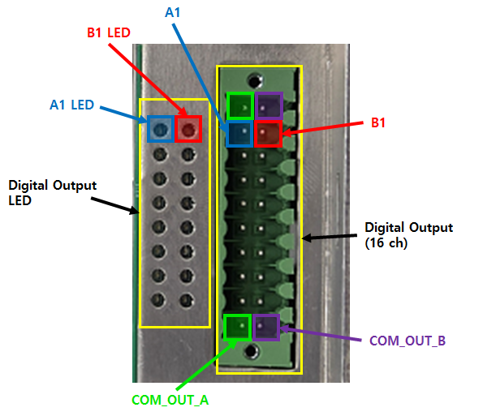
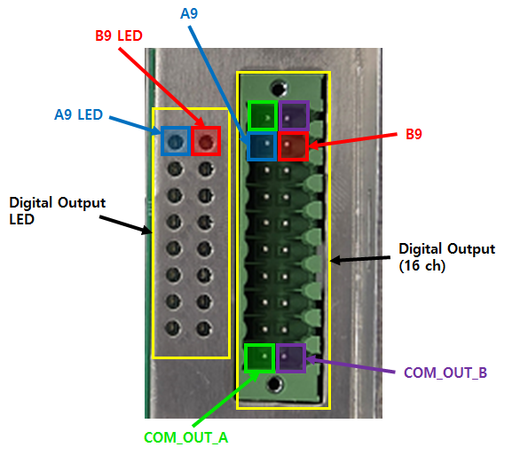

# 2.1.2. 디지털 출력

다음의 그림과 표는 디지털 출력용 터미널 블록의 핀 구성을 나타낸 것입니다. 
각 터미널 블록은 16개의 출력 신호를 출력할 수 있으며, 용도에 따라 NPN, PNP 타입을 출력할 수 있습니다. 
BD682를 추가 장착을 하게 되면, 디지털 출력 16pt가 추가 됩니다. 

 
<그림 1. 사용자 DIO (BD681) 디지털 출력 커넥터>


1번 핀과 10번 핀, 11번 핀과 20번 핀은 보드 내부에서 연결되어 있습니다.


<표 1. 사용자 DIO (BD681) 디지털 출력 커넥터>

<table>
<thead>
    <tr>
        <th style="width: 50px; text-align: center;">핀 번호</th>
        <th style="width: 50px; text-align: center;">신호명</th>
        <th style="width: 110px; text-align: center;">신호 설명</th>        
        <th style="width: 50px; text-align: center;">핀 번호</th>
        <th style="width: 50px; text-align: center;">신호명</th>
        <th style="width: 110px; text-align: center;">신호 설명</th>
    </tr>
</thead>
<tbody>
    <tr>
        <td style="text-align: center;">1</td>
        <td style="text-align: center;">
            <strong> COM_OUT_A </strong>
        </td>
        <td style="text-align: center;">
            COM 신호 (1 ~ 8)
        </td>
        <td style="text-align: center;">11</td>
        <td style="text-align: center;">
            <strong> COM_OUT_B </strong>
        </td>
        <td style="text-align: center;">
            COM 신호 (9~16)
        </td>
    </tr>
    <tr>
        <td style="text-align: center;">2</td>
        <td style="text-align: center;">
            <strong> A1 </strong>
        </td>
        <td style="text-align: center;">디지털 출력 1</td>
        <td style="text-align: center;">12</td>
        <td style="text-align: center;">
            <strong> B1 </strong>
        </td>
        <td style="text-align: center;">디지털 출력 9</td>
    </tr>
    <tr>
        <td style="text-align: center;">3</td>
        <td style="text-align: center;">A2</td>
        <td style="text-align: center;">디지털 출력 2</td>
        <td style="text-align: center;">13</td>
        <td style="text-align: center;">B2</td>
        <td style="text-align: center;">디지털 출력 10</td>
    </tr>
    <tr>
        <td style="text-align: center;">4</td>
        <td style="text-align: center;">A3</td>
        <td style="text-align: center;">디지털 출력 3</td>
        <td style="text-align: center;">14</td>
        <td style="text-align: center;">B3</td>
        <td style="text-align: center;">디지털 출력 11</td>
    </tr>
    <tr>
        <td style="text-align: center;">5</td>
        <td style="text-align: center;">A4</td>
        <td style="text-align: center;">디지털 출력 4</td>
        <td style="text-align: center;">15</td>
        <td style="text-align: center;">B4</td>
        <td style="text-align: center;">디지털 출력 12</td>
    </tr>
    <tr>
        <td style="text-align: center;">6</td>
        <td style="text-align: center;">A5</td>
        <td style="text-align: center;">디지털 출력 5</td>
        <td style="text-align: center;">16</td>
        <td style="text-align: center;">B5</td>
        <td style="text-align: center;">디지털 출력 13</td>
    </tr>
    <tr>
        <td style="text-align: center;">7</td>
        <td style="text-align: center;">A6</td>
        <td style="text-align: center;">디지털 출력 6</td>
        <td style="text-align: center;">17</td>
        <td style="text-align: center;">B6</td>
        <td style="text-align: center;">디지털 출력 14</td>
    </tr>
    <tr>
        <td style="text-align: center;">8</td>
        <td style="text-align: center;">A7</td>
        <td style="text-align: center;">디지털 출력 7</td>
        <td style="text-align: center;">18</td>
        <td style="text-align: center;">B7</td>
        <td style="text-align: center;">디지털 출력 15</td>
    </tr>
    <tr>
        <td style="text-align: center;">9</td>
        <td style="text-align: center;">A8</td>
        <td style="text-align: center;">디지털 출력 8</td>
        <td style="text-align: center;">19</td>
        <td style="text-align: center;">B8</td>
        <td style="text-align: center;">디지털 출력 16</td>
    </tr>
    <tr>
        <td style="text-align: center;">10</td>
        <td style="text-align: center;">
            <strong> COM_OUT_A </strong>
        </td>
        <td style="text-align: center;">
            COM 신호 (1~8)
        </td>
        <td style="text-align: center;">20</td>
        <td style="text-align: center;">
            <strong> COM_OUT_B </strong>
        </td>
        <td style="text-align: center;">
            COM 신호 (9~16)
        </td>
    </tr>
</tbody>
</table>
 

확장 DIO (BD682) 추가 장착 시 핀맵 은 아래와 같습니다. 

 
<그림 2. 확장 DIO (BD682) 디지털 출력 커넥터>


1번 핀과 10번 핀, 11번 핀과 20번 핀은 보드 내부에서 연결되어 있습니다.



BD682 의 디지털 출력 중, 12번 핀 ~ 19번 핀(디지털 출력 9 ~ 16)은 릴레이 출력 입니다.


<표 2. 확장 DIO (BD682) 디지털 출력 커넥터>

<table>
<thead>
    <tr>
        <th style="width: 50px; text-align: center;">핀 번호</th>
        <th style="width: 50px; text-align: center;">신호명</th>
        <th style="width: 110px; text-align: center;">신호 설명</th>        
        <th style="width: 50px; text-align: center;">핀 번호</th>
        <th style="width: 50px; text-align: center;">신호명</th>
        <th style="width: 110px; text-align: center;">신호 설명</th>
    </tr>
</thead>
<tbody>
    <tr>
        <td style="text-align: center;">1</td>
        <td style="text-align: center;">
            <strong> COM_OUT_A </strong>
        </td>
        <td style="text-align: center;">
            COM 신호 (1~8)
        </td>
        <td style="text-align: center;">11</td>
        <td style="text-align: center;">
            <strong> COM_OUT_B </strong>
        </td>
        <td style="text-align: center;">
            COM 신호 (9~16)
        </td>
    </tr>
    <tr>
        <td style="text-align: center;">2</td>
        <td style="text-align: center;">
            <strong> A9 </strong>
        </td>
        <td style="text-align: center;">디지털 출력 1</td>
        <td style="text-align: center;">12</td>
        <td style="text-align: center;">
            <strong> B9 </strong>
        </td>
        <td style="text-align: center;">디지털 출력 9</td>
    </tr>
    <tr>
        <td style="text-align: center;">3</td>
        <td style="text-align: center;">A10</td>
        <td style="text-align: center;">디지털 출력 2</td>
        <td style="text-align: center;">13</td>
        <td style="text-align: center;">B10</td>
        <td style="text-align: center;">디지털 출력 10</td>
    </tr>
    <tr>
        <td style="text-align: center;">4</td>
        <td style="text-align: center;">A11</td>
        <td style="text-align: center;">디지털 출력 3</td>
        <td style="text-align: center;">14</td>
        <td style="text-align: center;">B11</td>
        <td style="text-align: center;">디지털 출력 11</td>
    </tr>
    <tr>
        <td style="text-align: center;">5</td>
        <td style="text-align: center;">A12</td>
        <td style="text-align: center;">디지털 출력 4</td>
        <td style="text-align: center;">15</td>
        <td style="text-align: center;">B12</td>
        <td style="text-align: center;">디지털 출력 12</td>
    </tr>
    <tr>
        <td style="text-align: center;">6</td>
        <td style="text-align: center;">A13</td>
        <td style="text-align: center;">디지털 출력 5</td>
        <td style="text-align: center;">16</td>
        <td style="text-align: center;">B13</td>
        <td style="text-align: center;">디지털 출력 13</td>
    </tr>
    <tr>
        <td style="text-align: center;">7</td>
        <td style="text-align: center;">A14</td>
        <td style="text-align: center;">디지털 출력 6</td>
        <td style="text-align: center;">17</td>
        <td style="text-align: center;">B14</td>
        <td style="text-align: center;">디지털 출력 14</td>
    </tr>
    <tr>
        <td style="text-align: center;">8</td>
        <td style="text-align: center;">A15</td>
        <td style="text-align: center;">디지털 출력 7</td>
        <td style="text-align: center;">18</td>
        <td style="text-align: center;">B15</td>
        <td style="text-align: center;">디지털 출력 15</td>
    </tr>
    <tr>
        <td style="text-align: center;">9</td>
        <td style="text-align: center;">A16</td>
        <td style="text-align: center;">디지털 출력 8</td>
        <td style="text-align: center;">19</td>
        <td style="text-align: center;">B16</td>
        <td style="text-align: center;">디지털 출력 16</td>
    </tr>
    <tr>
        <td style="text-align: center;">10</td>
        <td style="text-align: center;">
            <strong> COM_OUT_A </strong>
        </td>
        <td style="text-align: center;">
            COM 신호 (1~8)
        </td>
        <td style="text-align: center;">20</td>
        <td style="text-align: center;">
            <strong> COM_OUT_B </strong>
        </td>
        <td style="text-align: center;">
            COM 신호 (9~16)
        </td>
    </tr>
</tbody>
</table>
 


디지털 출력의 NPN, PNP는 다음 표와 같이 COM 핀에 연결하는 전압을 통하여 설정할 수 있습니다.


<표 3. 디지털 출력 NPN, PNP 연결 정보>

<table>
<thead>
    <tr>
        <th style="width: 20px; text-align: center;">No.</th>
        <th style="width: 100px; text-align: center;">COM 핀 전압</th>
        <th style="width: 250px; text-align: center;">비고</th>
    </tr>
</thead>
<tbody>
    <tr>
        <td style="text-align: center;"><strong>1</strong></td>
        <td style="text-align: center;">24 V</td>
        <td> 
            PNP 출력 (Signal Active High) 전압 사용
        </td>
    </tr>
        <td style="text-align: center;"><strong>2</strong></td>
        <td style="text-align: center;">0 V</td>
        <td> 
            NPN 출력 (Signal Active Low) 전압 사용
        </td>
    </tr>
</tbody>
</table>

