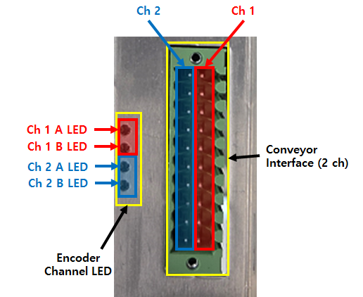

# 2.1.3. Conveyor Synchronization Configuration

The figure and table below illustrate the pin configuration of the terminal block for the encoder input and limit switch used in conveyor synchronization. 
The system consists of two input channels in total, and each channel can be connected to two types of encoders (open collector or line driver). 

 
< Figure 1. Extension DIO (BD682) Conveyor Interface Connector>

< Table 1. Extension DIO (BD682) Conveyor Interface Connector>

<table>
<thead>
    <tr>
        <th style="width: 50px; text-align: center;">Pin No.</th>
        <th style="width: 50px; text-align: center;">Signal</th>
        <th style="width: 220px; text-align: center;">Description</th>        
        <th style="width: 50px; text-align: center;">Pin No.</th>
        <th style="width: 50px; text-align: center;">Signal</th>
        <th style="width: 220px; text-align: center;">Description</th>   
    </tr>
</thead>
<tbody>
    <tr>
        <td style="text-align: center;">1</td>
        <td style="text-align: center;">PA2_P</td>
        <td style="text-align: center;">
            Channel 2 
            Line Driver Type Encoder 
            A Signal Input Positive
        </td>
        <td style="text-align: center;">11</td>
        <td style="text-align: center;">PA1_P</td>
        <td style="text-align: center;">
            Channel 1 
            Line Driver Type Encoder 
            A Signal Input Positive
        </td>
    </tr>
    <tr>
        <td style="text-align: center;">2</td>
        <td style="text-align: center;">PA2_N</td>
        <td style="text-align: center;">
            Channel 2 
            Line Driver Type Encoder 
            A Signal Input Negative
        </td>
        <td style="text-align: center;">12</td>
        <td style="text-align: center;">PA1_N</td>
        <td style="text-align: center;">
            Channel 1 
            Line Driver Type Encoder 
            A Signal Input Negative
        </td>
    </tr>
    <tr>
        <td style="text-align: center;">3</td>
        <td style="text-align: center;">PB2_P</td>
        <td style="text-align: center;">
            Channel 2 
            Line Driver Type Encoder 
            B Signal Input Positive
        </td>
        <td style="text-align: center;">13</td>
        <td style="text-align: center;">PB1_P</td>
        <td style="text-align: center;">
            Channel 1 
            Line Driver Type Encoder 
            B Signal Input Positive
        </td>
    </tr>
    <tr>
        <td style="text-align: center;">4</td>
        <td style="text-align: center;">PB2_N</td>
        <td style="text-align: center;">
            Channel 2 
            Line Driver Type Encoder 
            B Signal Input Negative
        </td>
        <td style="text-align: center;">14</td>
        <td style="text-align: center;">PB1_N</td>
        <td style="text-align: center;">
            Channel 1 
            Line Driver Type Encoder 
            B Signal Input Negative
        </td>
    </tr>
    <tr>
        <td style="text-align: center;">5</td>
        <td style="text-align: center;">LDLS2</td>
        <td style="text-align: center;">
            Channel 2 
            Line Driver Type Encoder 
            Limit Switch
        </td>
        <td style="text-align: center;">15</td>
        <td style="text-align: center;">LDLS1</td>
        <td style="text-align: center;">
            Channel 1 
            Line Driver Type Encoder 
            Limit Switch
        </td>
    </tr>
    <tr>
        <td style="text-align: center;">6</td>
        <td style="text-align: center;">GND</td>
        <td style="text-align: center;">Ground</td>
        <td style="text-align: center;">16</td>
        <td style="text-align: center;">GND</td>
        <td style="text-align: center;">Ground</td>
    </tr>
    <tr>
        <td style="text-align: center;">7</td>
        <td style="text-align: center;">P2+</td>
        <td style="text-align: center;">
            Channel 2 
            Open Collector Type Encoder 
            Power
        </td>
        <td style="text-align: center;">17</td>
        <td style="text-align: center;">P1+</td>
        <td style="text-align: center;">
            Channel 1 
            Open Collector Type Encoder 
            Power
        </td>
    </tr>
    <tr>
        <td style="text-align: center;">8</td>
        <td style="text-align: center;">A2</td>
        <td style="text-align: center;">
            Channel 2 
            Open Collector Type Encoder 
            A Signal Input
        </td>
        <td style="text-align: center;">18</td>
        <td style="text-align: center;">A1</td>
        <td style="text-align: center;">
            Channel 1 
            Open Collector Type Encoder 
            A Signal Input
        </td>
    </tr>
    <tr>
        <td style="text-align: center;">9</td>
        <td style="text-align: center;">B2</td>
        <td style="text-align: center;">
            Channel 2 
            Open Collector Type Encoder 
            B Signal Input
        </td>
        <td style="text-align: center;">19</td>
        <td style="text-align: center;">B1</td>
        <td style="text-align: center;">
            Channel 1 
            Open Collector Type Encoder 
            B Signal Input
        </td>
    </tr>
    <tr>
        <td style="text-align: center;">10</td>
        <td style="text-align: center;">OCLS2</td>
        <td style="text-align: center;">
            Channel 2 
            Open Collector Type Encoder 
            Limit Switch
        </td>
        <td style="text-align: center;">20</td>
        <td style="text-align: center;">OCLS1</td>
        <td style="text-align: center;">
            Channel 1 
            Open Collector Type Encoder 
            Limit Switch
        </td>
    </tr>
</tbody>
</table>
 
 

< Table 2. Extension DIO (BD682) Conveyor Interface Input Signal Electrical Specifications>

<table>
<thead>
    <tr>
        <th style="width: 20px; text-align: center;">No.</th>
        <th style="width: 100px; text-align: center;">
            Signal
        </th>
        <th style="width: 100px; text-align: center;">
            Electrical Specifications
        </th>
        <th style="width: 200px; text-align: center;">
            Note
        </th>
    </tr>
</thead>
<tbody>
    <tr>
        <td style="text-align: center;"><strong>1</strong></td>
        <td style="text-align: center;">
            PA1_P, PA1_N 
            PB1_P, PB1_N 
            PA2_P, PA2_N 
            PB2_P, PB2_N 
        </td>
        <td style="text-align: center;">
            0 V ~ 5 V 
            100 kHz or less
        </td>
        <td style="text-align: center;">
            Line Driver Type Encoder Signal
        </td>
    </tr>
    <tr>
        <td style="text-align: center;"><strong>2</strong></td>
        <td style="text-align: center;">
            LDLS1, LDLS2
        </td>
        <td style="text-align: center;">
            0 V / 5 V
        </td>
        <td style="text-align: center;">
            Line Driver Type Encoder 
            Limit Switch Signal
        </td>
    </tr>
    <tr>
        <td style="text-align: center;"><strong>3</strong></td>
        <td style="text-align: center;">
            P1+, P2+
        </td>
        <td style="text-align: center;">
            24 V
        </td>
        <td style="text-align: center;">
            Open Collector Type Encoder Power
        </td>
    </tr>
    <tr>
        <td style="text-align: center;"><strong>4</strong></td>
        <td style="text-align: center;">
            A1, B1 
            A2, B2
        </td>
        <td style="text-align: center;">
            0 V ~ 24 V 
            100 kHz or less
        </td>
        <td style="text-align: center;">
            Open Collector Type Encoder Signal
        </td>
    </tr>
    <tr>
        <td style="text-align: center;"><strong>5</strong></td>
        <td style="text-align: center;">
            OCLS1, OCLS2
        </td>
        <td style="text-align: center;">
            0 V / 24 V
        </td>
        <td style="text-align: center;">
            Open Collector Type Encoder 
            Limit Switch Signal
        </td>
    </tr>
</tbody>
</table>
 
