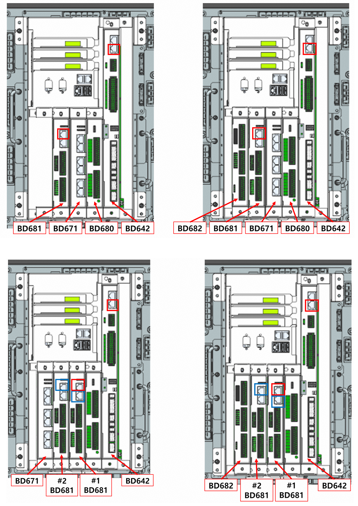

# 2.1.4. Board Installation Slots

The BD681 and BD682 boards must be installed in the correct slots in the robot controller.  
The following figure shows the slot positions in the controller.  

When using two BD681 boards, one BD681 board must be installed next to the BD680 board.

 
< Figure 1. Board Installation Slots>

