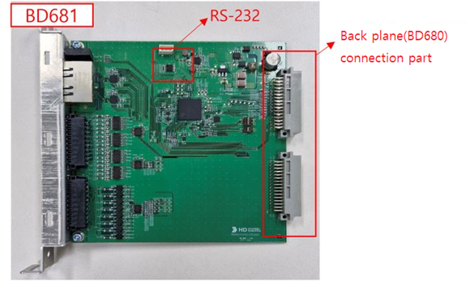
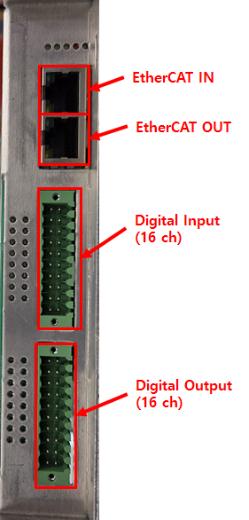
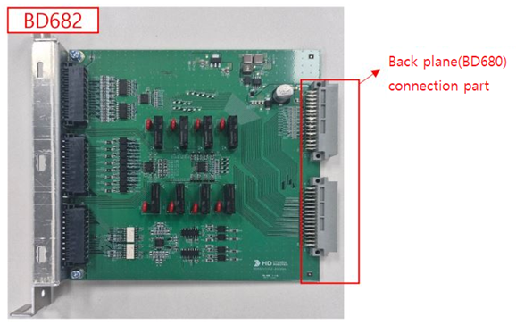
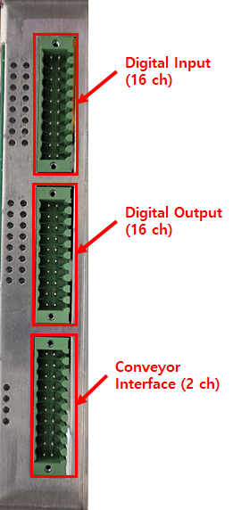

# 2.1. Hardware-Informationen

Mit der Anwender-DIO (BD681) können Sie verschiedene Geräte über digitale Ein-/Ausgänge anschließen oder konfigurieren. 
Darüber hinaus können Sie digitale Ein-/Ausgänge hinzufügen und über die Erweiterungs-DIO (BD682) mit dem Fördersystem synchronisieren. 
Die grundlegende Hardwarekonfiguration der Platine ist wie folgt. 

 
<Abbildung 1. Anwender-DIO (BD681)>

 

 
<Abbildung 2. Anschluss für Anwender-DIO (BD681)>

 

 
<Abbildung 3. Erweiterungs-DIO (BD682)>

 

 
<Abbildung 4. Anschluss für Erweiterungs-DIO (BD682)>
