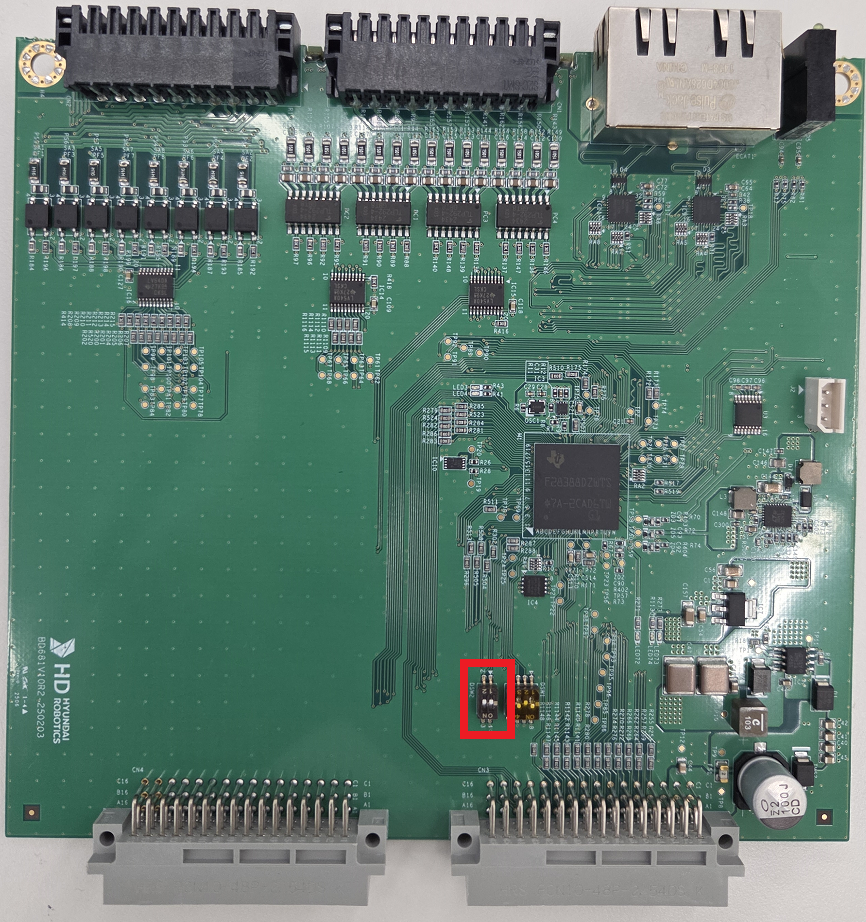
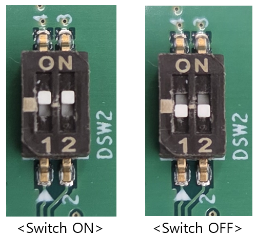

# 2.2. 보드 스위치

BD681 보드 스위치 위치는 아래 사진과 같습니다. 

 
<그림 1. 사용자DIO 보드 스위치 위치>
 

 
<그림 2. 사용자DIO 보드 스위치 ON/OFF>

 

<표 1. 보드 스위치 설정 정보>

<table>
<thead>
    <tr>
        <th style="width: 20px; text-align: center;">No.</th>
        <th style="width: 100px; text-align: center;">
            BD681 스위치  
            ON/OFF
        </th>
        <th style="width: 250px; text-align: center;">비고</th>
    </tr>
</thead>
<tbody>
    <tr>
        <td style="text-align: center;"><strong>1</strong></td>
        <td style="text-align: center;">OFF</td>
        <td> - 확장DIO (BD682) 연동 모드 
             - 기본 구성시 (BD681 + BD682) 사용 
        </td>
    </tr>
    <tr>
        <td style="text-align: center;"><strong>2</strong></td>
        <td style="text-align: center;">ON</td>
        <td> - 사용자DIO (BD681) 단독 모드  
             - 확장DIO (BD682) 연동 불가 
             - 기본 구성에 BD681 추가시 사용  
             - 추가된 2번째 BD681에 적용 필요  
        </td>
    </tr>
</tbody>
</table>


만약 스위치 확인을 위해 제어기에서 보드를 분리할때는 반드시 제어기 전원을 OFF 하고 보드 전원이 OFF 되었는지 확인 후 분리하시기 바랍니다.


<표 2. 사용자 DIO 모드 조합 사용 가능 여부>

<table>
<thead>
    <tr>
        <th style="width: 20px; text-align: center;">No.</th>
        <th style="width: 150px; text-align: center;">
            사용자 DIO (BD681),  
            확장 DIO (BD682) 수량
        </th>
        <th style="width: 150px; text-align: center;">
            BD681 스위치 
            ON/OFF
        </th>
        <th style="width: 110px; text-align: center;">
            사용 가능 여부
        </th>
    </tr>
</thead>
<tbody>
    <tr>
        <td style="text-align: center;"><strong>1</strong></td>
        <td style="text-align: center;">
            BD681 : 1 EA
        </td>
        <td style="text-align: center;">
            ON
        </td>
        <td style="text-align: center;">O (사용 가능)</td>
    </tr>
    <tr>
        <td style="text-align: center;"><strong>2</strong></td>
        <td style="text-align: center;">
            BD681 : 1 EA
        </td>
        <td style="text-align: center;">
            OFF
        </td>
        <td style="text-align: center;">X (사용 불가)</td>
    </tr>
    <tr>
        <td style="text-align: center;"><strong>3</strong></td>
        <td style="text-align: center;">
            BD681 : 1 EA 
            BD682 : 1 EA
        </td>
        <td style="text-align: center;">
            OFF
        </td>
        <td style="text-align: center;">O (사용 가능)</td>
    </tr>
    <tr>
        <td style="text-align: center;"><strong>4</strong></td>
        <td style="text-align: center;">
            BD681 : 1 EA 
            BD682 : 1 EA
        </td>
        <td style="text-align: center;">
            ON
        </td>
        <td style="text-align: center;">X (사용 불가)</td>
    </tr>
    <tr>
        <td style="text-align: center;"><strong>5</strong></td>
        <td style="text-align: center;">
            BD681 : 2 EA
        </td>
        <td style="text-align: center;">
            #1 BD681 스위치 ON 
            #2 BD681 스위치 ON
        </td>
        <td style="text-align: center;">O (사용 가능)</td>
    </tr>
    <tr>
        <td style="text-align: center;"><strong>6</strong></td>
        <td style="text-align: center;">
            BD681 : 2 EA
        </td>
        <td style="text-align: center;">
            #1 BD681 스위치 OFF 
            #2 BD681 스위치 ON
        </td>
        <td style="text-align: center;">X (사용 불가)</td>
    </tr>
    <tr>
        <td style="text-align: center;"><strong>7</strong></td>
        <td style="text-align: center;">
            BD681 : 2 EA
        </td>
        <td style="text-align: center;">
            #1 BD681 스위치 ON 
            #2 BD681 스위치 OFF
        </td>
        <td style="text-align: center;">X (사용 불가)</td>
    </tr>
    <tr>
        <td style="text-align: center;"><strong>8</strong></td>
        <td style="text-align: center;">
            BD681 : 2 EA
        </td>
        <td style="text-align: center;">
            #1 BD681 스위치 OFF 
            #2 BD681 스위치 OFF
        </td>
        <td style="text-align: center;">X (사용 불가)</td>
    </tr>
    <tr>
        <td style="text-align: center;"><strong>9</strong></td>
        <td style="text-align: center;">
            BD681 : 2 EA 
            BD682 : 1 EA
        </td>
        <td style="text-align: center;">
            #1 BD681 스위치 OFF 
            #2 BD681 스위치 ON
        </td>
        <td style="text-align: center;">O (사용 가능)</td>
    </tr>
    <tr>
        <td style="text-align: center;"><strong>10</strong></td>
        <td style="text-align: center;">
            BD681 : 2 EA 
            BD682 : 1 EA
        </td>
        <td style="text-align: center;">
            #1 BD681 스위치 OFF 
            #2 BD681 스위치 OFF
        </td>
        <td style="text-align: center;">X (사용 불가)</td>
    </tr>
    <tr>
        <td style="text-align: center;"><strong>11</strong></td>
        <td style="text-align: center;">
            BD681 : 2 EA 
            BD682 : 1 EA
        </td>
        <td style="text-align: center;">
            #1 BD681 스위치 ON 
            #2 BD681 스위치 OFF
        </td>
        <td style="text-align: center;">O (사용 가능)</td>
    </tr>
    <tr>
        <td style="text-align: center;"><strong>12</strong></td>
        <td style="text-align: center;">
            BD681 : 2 EA 
            BD682 : 1 EA
        </td>
        <td style="text-align: center;">
            #1 BD681 스위치 ON 
            #2 BD681 스위치 ON
        </td>
        <td style="text-align: center;">X (사용 불가)</td>
    </tr>
</tbody>
</table>
 

