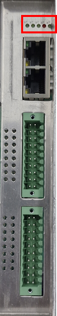
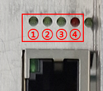

# 2.3. Status-LED der Platine

Die BD681 verfügt über eine LED, die den Status der Platine anzeigt. 
Anhand des Betriebsstatus der LED können Sie überprüfen, ob die Platine ordnungsgemäß funktioniert.

 
<Abbildung 1. Status-LED der Platine>

 

 
<Abbildung 2. Details zur Status-LED der Platine>

 

<Tabelle 1. Details zur Status-LED der Platine>

<table>
<thead>
    <tr>
        <th style="width: 20px; text-align: center;">No.</th>
        <th style="width: 80px; text-align: center;">LED-Farbe</th>
        <th style="width: 110px; text-align: center;">LED-Bezeichnung</th>
        <th style="width: 160px; text-align: center;">Anmerkungen</th>
    </tr>
</thead>
<tbody>
    <tr>
        <td style="text-align: center;"><strong>1</strong></td>
        <td style="text-align: center;">Grün</td>
        <td style="text-align: center;">IO_LED</td>
        <td style="text-align: center;">MCU (CPU 1)-Status</td>
    </tr>
    <tr>
        <td style="text-align: center;"><strong>2</strong></td>
        <td style="text-align: center;">Grün</td>
        <td style="text-align: center;">MOD_LED</td>
        <td style="text-align: center;">MCU (CM)-Status</td>
    </tr>
    <tr>
        <td style="text-align: center;"><strong>3</strong></td>
        <td style="text-align: center;">Green</td>
        <td style="text-align: center;">EC_LED_RUN</td>
        <td style="text-align: center;">EtherCAT-Betriebsstatus</td>
    </tr>
    <tr>
        <td style="text-align: center;"><strong>4</strong></td>
        <td style="text-align: center;">Rot</td>
        <td style="text-align: center;">EC_LED_ERR</td>
        <td style="text-align: center;">EtherCAT-Fehlerstatus</td>
    </tr>
</tbody>
</table>
 

 

<Tabelle 2. LED entsprechend dem EtherCAT-Status>

<table>
<thead>
    <tr>
        <th style="width: 110px; text-align: center;">LED-Bezeichnung</th>
        <th style="width: 160px; text-align: center;">LED-Status</th>
        <th style="width: 160px; text-align: center;">EtherCAT-Status</th>
    </tr>
</thead>
<tbody>
    <tr>
        <td rowspan="4" style="text-align: center;">EC_LED_RUN</td>
        <td style="text-align: center;">OFF</td>
        <td style="text-align: center;">INIT</td>
    </tr>
    <tr>
        <td style="text-align: center;">Flashing</td>
        <td style="text-align: center;">Pre-OP</td>
    </tr>
    <tr>
        <td style="text-align: center;">Single Flashing</td>
        <td style="text-align: center;">Safe-OP</td>
    </tr>
    <tr>
        <td style="text-align: center;">ON</td>
        <td style="text-align: center;">OP</td>
    </tr>
        <tr>
        <td rowspan="2" style="text-align: center;">EC_LED_ERR</td>
        <td style="text-align: center;">OFF</td>
        <td style="text-align: center;">No Error</td>
    </tr>
    <tr>
        <td style="text-align: center;">Blinkend</td>
        <td style="text-align: center;">Fehler</td>
    </tr>
</tbody>
</table>
 

 

<Tabelle 3. LED entsprechend dem MCU-Betriebsstatus>

<table>
<thead>
    <tr>
        <th style="width: 110px; text-align: center;">LED-Bezeichnung</th>
        <th style="width: 160px; text-align: center;">LED-Status</th>
        <th style="width: 160px; text-align: center;">MCU-Betriebsstatus</th>
    </tr>
</thead>
<tbody>
    <tr>
        <td rowspan="4" style="text-align: center;">
            IO_LED, 
            MOD_LED
        </td>
        <td style="text-align: center;">Blinkt in 2-Sekunden-Intervallen</td>
        <td style="text-align: center;">EtherCAT-Verbindung wird erwartet</td>
    </tr>
    <tr>
        <td style="text-align: center;">Blinkt in 0,25-Sekunden-Intervallen</td>
        <td style="text-align: center;">
            EtherCAT-Verbindung in Ordnung, 
            Warten auf Anfangseinstellwerte
        </td>
    </tr>
    <tr>
        <td style="text-align: center;">Blinkt in 0,75-Sekunden-Intervallen</td>
        <td style="text-align: center;">
            EtherCAT-Verbindung in Ordnung, 
            Anfangseinstellung in Ordnung
        </td>
    </tr>
    <tr>
        <td style="text-align: center;">Blinkt in 0,1-Sekunden-Intervallen</td>
        <td style="text-align: center;">
            EtherCAT-Verbindungsstatus anormal, 
            Anfangseinstellung in Ordnung
        </td>
    </tr>
</tbody>
</table>
 


Wenn die IO_LED und die MOD_LED nicht mehr blinken (entweder ausgeschaltet oder ständig eingeschaltet), ist der MCU-Betrieb nicht normal.

