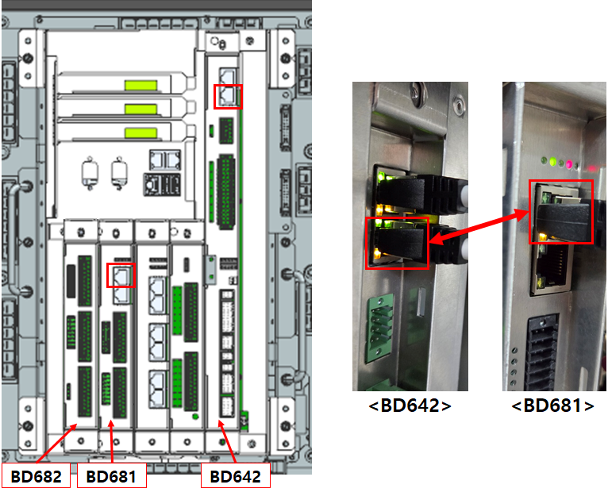
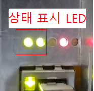
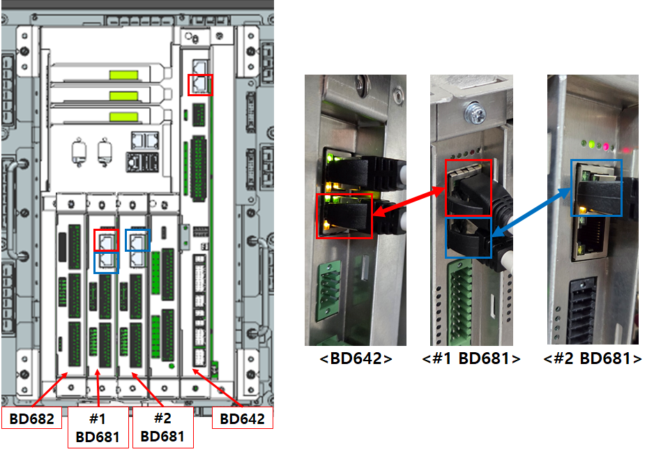
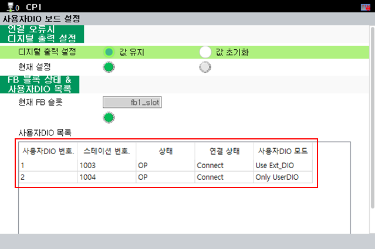

# 3.1. EtherCAT 설정

EtherCAT 설정은 다음과 같이 진행합니다.

제어기를 OFF 한 상태에서 LAN 케이블을 올바르게 연결해야 합니다.

<mark style="color:green;">**- BD681 1개 구성 ( BD681 + BD682 )**</mark>

 
<그림 1. BD681 1개 케이블 연결>

위의 그림과 같이 BD642의 아래쪽 랜커넥터와 BD681 위쪽 랜커넥터를 연결한 후 제어기 전원을 ON 합니다. 정상적으로 EtherCAT이 연결되면 아래와 같이 TP에서 '사용자DIO 목록'으로 확인 가능합니다.

**- 메뉴 위치: [시스템] - [옵션 장치] - [사용자 DIO 보드 설정]**

 
<그림 2. BD681 1개 사용자DIO 보드 설정> 

 
<그림 3. BD681 상태표시 LED> 

BD681 보드의 상태표시 LED는 정상적으로 연결이 완료 될 경우, 아래와 같이 동작합니다.  

- BD681 보드 상태표시 LED 동작
1. 2초 간격으로 점멸 (EtherCAT 연결 대기중)
2. 0.25초 간격으로 점멸 (EtherCAT 연결 Ok, 초기 설정값 대기중)
3. 0.75초 간격으로 점멸 (EtherCAT 연결 Ok, 초기 설정 Ok)
  

<mark style="color:green;">**- BD681 2개 구성 ( #1_BD681 + BD682 + #2_BD681 )**</mark>

 
<그림 4. BD681 2개 케이블 연결>

위의 그림과 같이 #1 BD681 자리 옆에 #2 BD681을 꽂아 넣습니다.


#2 BD681은 보드 스위치가 ON 되어야 합니다.


보드 스위치에 대한 세부 내용은 "[2.2 보드 스위치](../2-HW/2-Board-Switch.md)" 및 "[3.2 보드 스위치 확인](./2-Board-Switch-check.md)" 매뉴얼을 참고하시기 바랍니다.

BD642의 아래쪽 랜커넥터와 #1 BD681 위쪽 랜커넥터를 연결한 후, #1 BD681 아래쪽 랜커넥터와 #2 BD681 위쪽 랜커넥터를 연결합니다. 그리고 제어기 전원을 ON 합니다. 정상적으로 EtherCAT이 연결되면 아래와 같이 TP에서 확인 가능합니다.

 
<그림 5. BD681 2개 사용자DIO 보드 설정> 

BD681 보드의 상태표시 LED는 정상적으로 연결 될 경우, 'BD681 1개 구성'의 'BD681 보드 상태표시 LED 동작' 과 동일하게 동작합니다.

