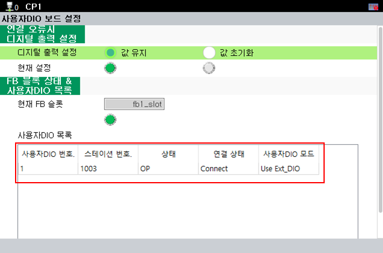

# 3.1. EtherCAT-Einstellungen

Die EtherCAT-Einstellungen werden wie folgt vorgenommen.

Das LAN-Kabel muss bei ausgeschalteter Steuerung korrekt angeschlossen sein.

<mark style="color:green;">**- Einzel-BD681-Konfiguration (BD681 + BD682)**</mark>

 
<Abbildung 1. Kabelverbindung für die Einzel-BD681-Konfiguration>

Verbinden Sie den unteren LAN-Anschluss des BD642 und den oberen LAN-Anschluss der BD681 wie in der Abbildung oben gezeigt und schalten Sie dann die Stromversorgung der Steuerung ein. Wenn EtherCAT normal verbunden ist, können Sie dies in der „Anwender-DIO-Liste“ auf dem TP wie unten gezeigt überprüfen.

**- Menüposition: [System] - [Optionales Gerät] - [Einstellungen der Anwender-DIO-Platine]**

 
<Abbildung 2. Einstellungen für einzelne Anwender-DIO-Platine BD681> 

 
<Abbildung 3. Status-LED der BD681> 

Wenn die Verbindung ordnungsgemäß hergestellt wurde, funktioniert die Status-LED der BD681-Platine wie folgt.

- Funktion der Status-LED der BD681-Platine
1. Blinkt in Intervallen von 2 Sekunden (EtherCAT-Verbindung wird erwartet)
2. Blinkt in Intervallen von 0,25 Sekunden (EtherCAT-Verbindung OK, wartet auf Anfangseinstellwerte)
3. Blinkt in Intervallen von 0,75 Sekunden (EtherCAT-Verbindung OK, Anfangseinstellung OK)
  

<mark style="color:green;">**- Dual-BD681-Konfiguration(#1_BD681 + BD682 + #2_BD681)**</mark>

 
<Abbildung 4. Kabelverbindung für die Dual-BD681-Konfiguration>

Stecken Sie die BD681 #2 neben den Steckplatz der BD681 #1, wie in der Abbildung oben gezeigt.


Der Schalter der BD681-Platine #2 muss auf ON stehen.


Ausführliche Informationen zum Platinenschalter finden Sie in den Handbüchern „[2.2 Platinenschalter](../2-HW/2-Board-Switch.md)" und „[3.2 Überprüfung des Platinenschalters](./2-Board-Switch-check.md)".

Verbinden Sie den unteren LAN-Anschluss des BD642 mit dem oberen LAN-Anschluss des #1 BD681 und anschließend den unteren LAN-Anschluss des #1 BD681 mit dem oberen LAN-Anschluss des #2 BD681. Schalten Sie dann die Stromversorgung der Steuerung ein. Wenn EtherCAT ordnungsgemäß verbunden ist, können Sie dies wie unten gezeigt auf dem TP überprüfen.

 
<Abbildung 5. Einstellungen der Dual-Anwender-DIO-Platine BD681> 

Wenn die BD681-Platine normal angeschlossen ist, funktioniert die Status-LED genauso wie unter „Funktion der Status-LED der BD681-Platine” in „Einzel-BD681-Konfiguration” beschrieben.

