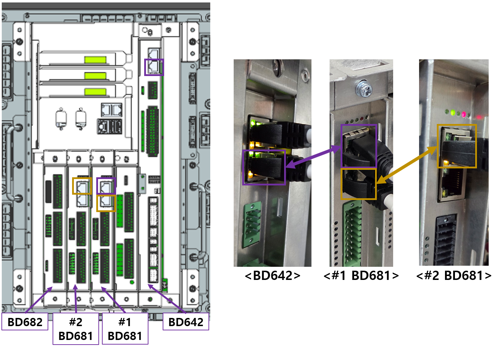
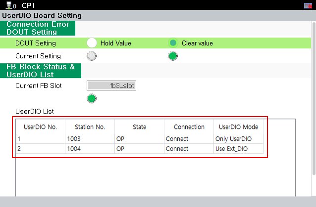

# 3.1. EtherCAT 配置

EtherCAT 配置步骤如下。

确保在控制器关闭时正确连接 LAN 电缆。

<mark style="color:green;">**- 单个 BD681 配置 ( BD681 + BD682 )**</mark>

 
< Figure 1. 单个 BD681 电缆连接>

如上图所示，将 BD642 的下部 LAN 连接器连接到 BD681 的上部 LAN 连接器，然后打开控制器电源。如果 EtherCAT 正常连接，可以在 TP 上的 "UserDIO List" 中验证，如下所示。

**- 菜单位置: [system] - [12: Option System] - [UserDIO Board Setting]**

 
< Figure 2. 单个 BD681 配置> 

 
< Figure 3. BD681 状态 LED> 

当连接成功完成时，BD681 板上的状态指示 LED 的操作如下。

- BD681 状态 LED 操作
1. 每2秒闪烁一次（等待 EtherCAT 连接）
2. 每0.25秒闪烁一次（EtherCAT 连接正常，等待初始设置）
3. 每0.75秒闪烁一次（EtherCAT 连接正常，初始设置正常）
  

<mark style="color:green;">**- 使用 2 个 BD681 单元的配置 ( #1_BD681 + BD682 + #2_BD681 )**</mark>

 
< Figure 4. 使用 2 个 BD681 单元的电缆连接>

如上图所示，将 BD681 #2 插入 BD681 #1 旁边的插槽。


对于 #2 BD681，主板开关必须设置为 ON。


有关主板开关的详细信息，请参阅手册中的 "[2.2 主板开关](../2-HW/2-Board-Switch.md)" 和 "[3.2 主板开关检查](./2-Board-Switch-check.md)"。

将 BD642 的下部 LAN 连接器连接到 #1 BD681 的上部 LAN 连接器，然后将 #1 BD681 的下部 LAN 连接器连接到 #2 BD681 的上部 LAN 连接器。之后，打开控制器电源。如果 EtherCAT 成功连接，可以在 TP 上进行检查，如下所示。

 
< Figure 5. BD681 (2 单元) 配置> 

当连接成功建立时，BD681 板的状态 LED 操作与 "单个 BD681 配置" 中 "BD681 状态 LED 操作" 描述的方式相同。

<mark style="color:green;">**- 使用 2 个 BD681 单元的配置 ( #1_BD681 + #2_BD681 + BD682 )**</mark>
 
< Figure 6. 2个BD681单元的电缆连接>

如上图所示，将BD681 #1插入BD681 #2旁边的插槽中。


对于#1 BD681，电路板开关必须设置为开启。


 
< Figure 7. BD681 (2个单元) 配置> 

<mark style="color:green;">**- 2个BD681单元的配置 ( #1_BD681 + #2_BD681 )**</mark>


要在没有BD682的情况下使用两个BD681板，#1 BD681和#2 BD681的电路板开关必须都设置为开启。


_en.png) 
< Figure 8. 没有BD682的BD681 (2个单元) 配置> 