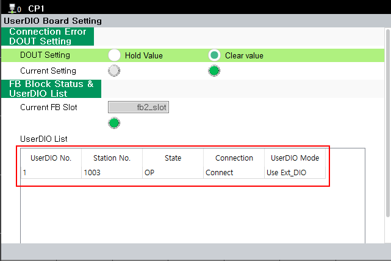
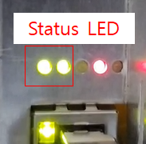
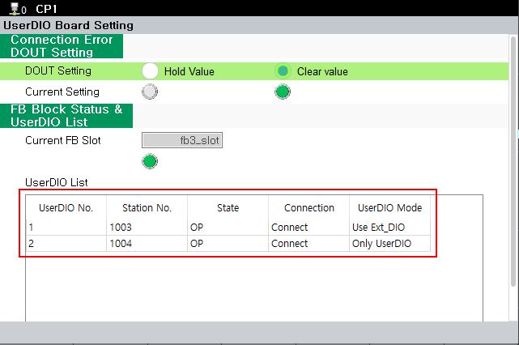

# 3.1. EtherCAT Configuration

EtherCAT configuration is performed as follows.

Make sure to connect the LAN cable correctly while the controller is turned off.

<mark style="color:green;">**- Single BD681 Configuration ( BD681 + BD682 )**</mark>

 
< Figure 1. Single BD681 Cable Connection>

As shown in the figure above, connect the lower LAN connector of BD642 to the upper LAN connector of BD681, and then turn on the controller power. If EtherCAT is connected normally, it can be verified on the TP under “UserDIO List,” as shown below.

**- The location of the menu: [system] - [12: Option System] - [UserDIO Board Setting]**

 
< Figure 2. Single BD681 Configuration> 

 
< Figure 3. BD681 status LED> 

When the connection is successfully completed, the status indicator LED on the BD681 board operates as follows.

- BD681 status LED operation
1. Flashing at 2-second intervals (waiting for EtherCAT connection)
2. Flashing at 0.25-second intervals (EtherCAT connection Ok, Waiting for Initial Settings)
3. Flashing at 0.75-second intervals (EtherCAT connection Ok, Initial Settings Ok)
  

<mark style="color:green;">**- Configuration with 2 BD681 Units ( #1_BD681 + BD682 + #2_BD681 )**</mark>

 
< Figure 4. Cable Connection with 2 BD681 Units>

As shown in the figure above, insert BD681 #2 into the slot next to BD681 #1.


For #2 BD681, the board switch must be set to ON.


For detailed information on the board switch, refer to "[2.2 Board Switch](../2-HW/2-Board-Switch.md)" and "[3.2 Board Switch Check](./2-Board-Switch-check.md)" in the manual.

Connect the lower LAN connector of BD642 to the upper LAN connector of #1 BD681, and then connect the lower LAN connector of #1 BD681 to the upper LAN connector of #2 BD681. After that, turn on the controller power. If EtherCAT is connected successfully, it can be checked on the TP as shown below.

 
< Figure 5. BD681 (2 Units) Configuration> 

When the connection is established successfully, the status LED of the BD681 board operates in the same way as described in “Single BD681 Configuration” under “BD681 status LED operation”
