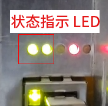

# 3.1. EtherCAT Configuration

EtherCAT configuration is performed as follows.

Make sure to connect the LAN cable correctly while the controller is turned off.

<mark style="color:green;">**- Single BD681 Configuration ( BD681 + BD682 )**</mark>

 
< Figure 1. Single BD681 Cable Connection>

As shown in the figure above, connect the lower LAN connector of BD642 to the upper LAN connector of BD681, and then turn on the controller power. If EtherCAT is connected normally, it can be verified on the TP under “UserDIO List,” as shown below.

**- The location of the menu: [system] - [12: Option System] - [UserDIO Board Setting]**

 
< Figure 2. Single BD681 Configuration> 

 
< Figure 3. BD681 status LED> 

When the connection is successfully completed, the status indicator LED on the BD681 board operates as follows.

- BD681 status LED operation
1. Flashing at 2-second intervals (waiting for EtherCAT connection)
2. 0.25초 점등 (EtherCAT 연결 Ok, 초기 설정값 대기중)
3. 0.75초 점등 (EtherCAT 연결 Ok, 초기 설정 Ok)
  

<mark style="color:green;">**- BD681 2개 구성 ( #1_BD681 + BD682 + #2_BD681 )**</mark>

 
< Figure 4. BD681 2개 케이블 연결>

위의 그림과 같이 #1 BD681 자리 옆에 #2 BD681을 꽂아 넣습니다.


#2 BD681은 보드 스위치가 ON 되어야 합니다.


보드 스위치에 대한 세부 내용은 "[2.2 보드 스위치](../2-HW/2-Board-Switch.md)" 및 "[3.2 보드 스위치 확인](./2-Board-Switch-check.md)" 매뉴얼을 참고하시기 바랍니다.

BD642의 아래쪽 랜커넥터와 #1 BD681 위쪽 랜커넥터를 연결한 후, #1 BD681 아래쪽 랜커넥터와 #2 BD681 위쪽 랜커넥터를 연결합니다. 그리고 제어기 전원을 ON 합니다. 정상적으로 EtherCAT이 연결되면 아래와 같이 TP에서 확인 가능합니다.

 
< Figure 5. BD681 2개 사용자DIO 보드 설정> 

BD681 보드의 상태표시 LED는 정상적으로 연결 될 경우, 'BD681 1개 구성'의 'BD681 보드 상태표시 LED 동작' 과 동일하게 동작합니다.

