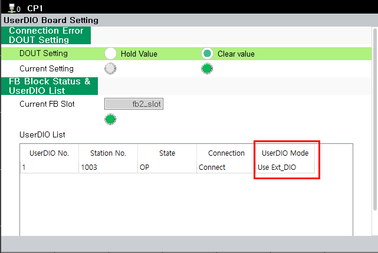

# 3.2. Board Switch Check

If the board has already been assembled in the controller, the internal switch status can be checked on the TP screen as shown below. 

**- The location of the menu: [system] - [12: Option System] - [UserDIO Board Setting]**

You can check it in the “UserDIO List,” under the “UserDIO Mode” entry.


In order to check correctly in [User DIO Board Setting], BD681 must be connected to EtherCAT successfully.


 
< Figure 1. UserDIO Board Setting TP UI> 

 

< Table 1. User DIO Mode Item>

<table>
<thead>
    <tr>
        <th style="width: 20px; text-align: center;">No.</th>
        <th style="width: 100px; text-align: center;">
            BD681 Switch  
            ON/OFF
        </th>
        <th style="width: 110px; text-align: center;">
            UserDIO Mode
        </th>
    </tr>
</thead>
<tbody>
    <tr>
        <td style="text-align: center;"><strong>1</strong></td>
        <td style="text-align: center;">OFF</td>
        <td style="text-align: center;">
            Use Ext_DIO  
            (BD681 + BD682)
        </td>
    </tr>
    <tr>
        <td style="text-align: center;"><strong>2</strong></td>
        <td style="text-align: center;">ON</td>
        <td style="text-align: center;">
            Only UserDIO  
            (BD681)
        </td>
    </tr>
</tbody>
</table>
 

When using two User DIO boards, if the switch of the second User DIO board is set to OFF, error <strong>“E55005 : The 2nd User DIO Board switch setting error detected.”</strong> will be generated. 
To resolve this error, set the switch of the second User DIO board to ON.


If error “E55005 : The 2nd User DIO Board switch setting error detected.” occurs, the User DIO board and Extension DIO board cannot be used properly. You must correct the board switch settings before using them.


 

< Table 2. Supported User DIO Mode Combinations>

<table>
<thead>
    <tr>
        <th style="width: 20px; text-align: center;">No.</th>
        <th style="width: 250px; text-align: center;">
            User DIO (BD681) /  Extension DIO (BD682) Quantity
        </th>
        <th style="width: 150px; text-align: center;">
            BD681 Switch 
            ON/OFF
        </th>
        <th style="width: 110px; text-align: center;">
            Availability
        </th>
    </tr>
</thead>
<tbody>
    <tr>
        <td style="text-align: center;"><strong>1</strong></td>
        <td style="text-align: center;">
            BD681 : 1 EA
        </td>
        <td style="text-align: center;">
            ON 
            (Only UserDIO)
        </td>
        <td style="text-align: center;">O (Available)</td>
    </tr>
    <tr>
        <td style="text-align: center;"><strong>2</strong></td>
        <td style="text-align: center;">
            BD681 : 1 EA
        </td>
        <td style="text-align: center;">
            OFF 
            (Use Ext_DIO)
        </td>
        <td style="text-align: center;">X (Unavailable)</td>
    </tr>
    <tr>
        <td style="text-align: center;"><strong>3</strong></td>
        <td style="text-align: center;">
            BD681 : 1 EA 
            BD682 : 1 EA
        </td>
        <td style="text-align: center;">
            OFF 
            (Use Ext_DIO)
        </td>
        <td style="text-align: center;">O (Available)</td>
    </tr>
    <tr>
        <td style="text-align: center;"><strong>4</strong></td>
        <td style="text-align: center;">
            BD681 : 1 EA 
            BD682 : 1 EA
        </td>
        <td style="text-align: center;">
            ON 
            (Only UserDIO)
        </td>
        <td style="text-align: center;">X (Unavailable)</td>
    </tr>
    <tr>
        <td style="text-align: center;"><strong>5</strong></td>
        <td style="text-align: center;">
            BD681 : 2 EA 
            BD682 : 1 EA
        </td>
        <td style="text-align: center;">
            #1 BD681 Switch OFF 
            (Use Ext_DIO)  
            #2 BD681 Switch ON 
            (Only UserDIO)
        </td>
        <td style="text-align: center;">O (Available)</td>
    </tr>
    <tr>
        <td style="text-align: center;"><strong>6</strong></td>
        <td style="text-align: center;">
            BD681 : 2 EA 
            BD682 : 1 EA
        </td>
        <td style="text-align: center;">
            #1 BD681 Switch OFF 
            (Use Ext_DIO)  
            #2 BD681 Switch OFF 
            (Use Ext_DIO)
        </td>
        <td style="text-align: center;">X (Unavailable)</td>
    </tr>
    <tr>
        <td style="text-align: center;"><strong>7</strong></td>
        <td style="text-align: center;">
            BD681 : 2 EA 
            BD682 : 1 EA
        </td>
        <td style="text-align: center;">
            #1 BD681 Switch ON 
            (Only UserDIO)  
            #2 BD681 Switch OFF 
            (Use Ext_DIO)
        </td>
        <td style="text-align: center;">O (Available)</td>
    </tr>
    <tr>
        <td style="text-align: center;"><strong>8</strong></td>
        <td style="text-align: center;">
            BD681 : 2 EA 
            BD682 : 1 EA
        </td>
        <td style="text-align: center;">
            #1 BD681 Switch ON 
            (Only UserDIO)  
            #2 BD681 Switch ON 
            (Only UserDIO)
        </td>
        <td style="text-align: center;">X (Unavailable)</td>
    </tr>
</tbody>
</table>
 
