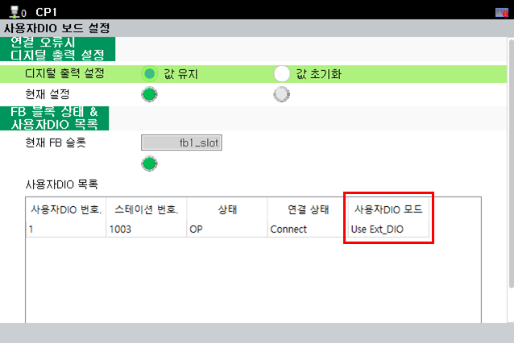

# 3.2. 보드 스위치 확인

이미 보드가 제어기에 조립되었을 경우, 아래와 같은 TP화면에서 내부 스위치 상태를 확인할 수 있습니다. 

**- 메뉴 위치 : [시스템] - [옵션장치] - [사용자DIO 보드 설정]**

'사용자DIO 목록' 에서 '사용자DIO 모드' 항목으로 확인할 수 있습니다.


[사용자DIO 보드 설정]에서 정상적으로 확인하려면, BD681의 EtherCAT 연결이 정상적으로 되어야 합니다.


 
<그림 1. 사용자DIO 보드 설정 TP UI> 

 

<표 1. 사용자DIO 모드 항목>

<table>
<thead>
    <tr>
        <th style="width: 20px; text-align: center;">No.</th>
        <th style="width: 100px; text-align: center;">
            BD681 스위치  
            ON/OFF
        </th>
        <th style="width: 110px; text-align: center;">
            사용자DIO 모드
        </th>
    </tr>
</thead>
<tbody>
    <tr>
        <td style="text-align: center;"><strong>1</strong></td>
        <td style="text-align: center;">OFF</td>
        <td style="text-align: center;">
            Use Ext_DIO  
            (BD681 + BD682)
        </td>
    </tr>
    <tr>
        <td style="text-align: center;"><strong>2</strong></td>
        <td style="text-align: center;">ON</td>
        <td style="text-align: center;">
            Only UserDIO  
            (BD681)
        </td>
    </tr>
</tbody>
</table>
 

사용자 DIO 보드를 2개 사용할 때, 2번째 사용자 DIO 보드 스위치가 OFF 되어있으면 <strong>"E55005 2번째 사용자 DIO 보드 스위치 설정 오류 감지"</strong> 에러를 출력합니다.
해당 에러를 해결하기 위해서는 2번째 사용자 DIO 보드 스위치를 ON으로 변경하여야 합니다.


"E55005 2번째 사용자 DIO 보드 스위치 설정 오류 감지" 에러가 발생하였을 경우, 사용자 DIO 보드와 확장 DIO 보드를 정상적으로 사용할 수 없습니다. 보드의 스위치 설정을 올바르게 변경한 후에 사용해야 합니다.


 

<표 2. 사용자 DIO 모드 조합 사용 가능 여부>

<table>
<thead>
    <tr>
        <th style="width: 20px; text-align: center;">No.</th>
        <th style="width: 150px; text-align: center;">
            사용자 DIO (BD681),  
            확장 DIO (BD682) 수량
        </th>
        <th style="width: 150px; text-align: center;">
            BD681 스위치 
            ON/OFF
        </th>
        <th style="width: 110px; text-align: center;">
            사용 가능 여부
        </th>
    </tr>
</thead>
<tbody>
    <tr>
        <td style="text-align: center;"><strong>1</strong></td>
        <td style="text-align: center;">
            BD681 : 1 EA
        </td>
        <td style="text-align: center;">
            ON 
            (Only UserDIO)
        </td>
        <td style="text-align: center;">O (사용 가능)</td>
    </tr>
    <tr>
        <td style="text-align: center;"><strong>2</strong></td>
        <td style="text-align: center;">
            BD681 : 1 EA
        </td>
        <td style="text-align: center;">
            OFF 
            (Use Ext_DIO)
        </td>
        <td style="text-align: center;">X (사용 불가)</td>
    </tr>
    <tr>
        <td style="text-align: center;"><strong>3</strong></td>
        <td style="text-align: center;">
            BD681 : 1 EA 
            BD682 : 1 EA
        </td>
        <td style="text-align: center;">
            OFF 
            (Use Ext_DIO)
        </td>
        <td style="text-align: center;">O (사용 가능)</td>
    </tr>
    <tr>
        <td style="text-align: center;"><strong>4</strong></td>
        <td style="text-align: center;">
            BD681 : 1 EA 
            BD682 : 1 EA
        </td>
        <td style="text-align: center;">
            ON 
            (Only UserDIO)
        </td>
        <td style="text-align: center;">X (사용 불가)</td>
    </tr>
    <tr>
        <td style="text-align: center;"><strong>5</strong></td>
        <td style="text-align: center;">
            BD681 : 2 EA 
            BD682 : 1 EA
        </td>
        <td style="text-align: center;">
            #1 BD681 스위치 OFF 
            (Use Ext_DIO)  
            #2 BD681 스위치 ON 
            (Only UserDIO)
        </td>
        <td style="text-align: center;">O (사용 가능)</td>
    </tr>
    <tr>
        <td style="text-align: center;"><strong>6</strong></td>
        <td style="text-align: center;">
            BD681 : 2 EA 
            BD682 : 1 EA
        </td>
        <td style="text-align: center;">
            #1 BD681 스위치 OFF 
            (Use Ext_DIO)  
            #2 BD681 스위치 OFF 
            (Use Ext_DIO)
        </td>
        <td style="text-align: center;">X (사용 불가)</td>
    </tr>
    <tr>
        <td style="text-align: center;"><strong>7</strong></td>
        <td style="text-align: center;">
            BD681 : 2 EA 
            BD682 : 1 EA
        </td>
        <td style="text-align: center;">
            #1 BD681 스위치 ON 
            (Only UserDIO)  
            #2 BD681 스위치 OFF 
            (Use Ext_DIO)
        </td>
        <td style="text-align: center;">X (사용 불가)</td>
    </tr>
    <tr>
        <td style="text-align: center;"><strong>8</strong></td>
        <td style="text-align: center;">
            BD681 : 2 EA 
            BD682 : 1 EA
        </td>
        <td style="text-align: center;">
            #1 BD681 스위치 ON 
            (Only UserDIO)  
            #2 BD681 스위치 ON 
            (Only UserDIO)
        </td>
        <td style="text-align: center;">X (사용 불가)</td>
    </tr>
</tbody>
</table>
 
