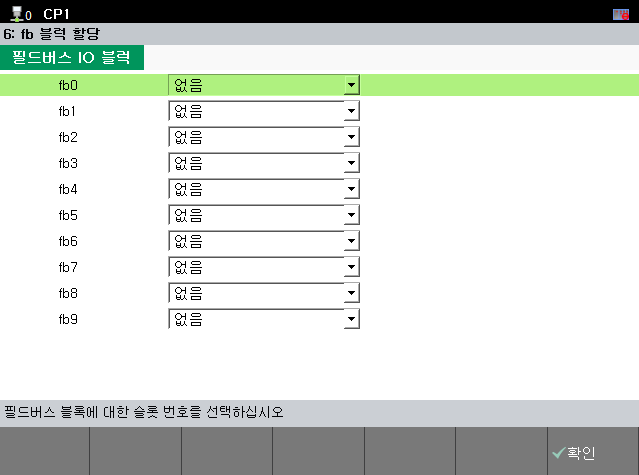
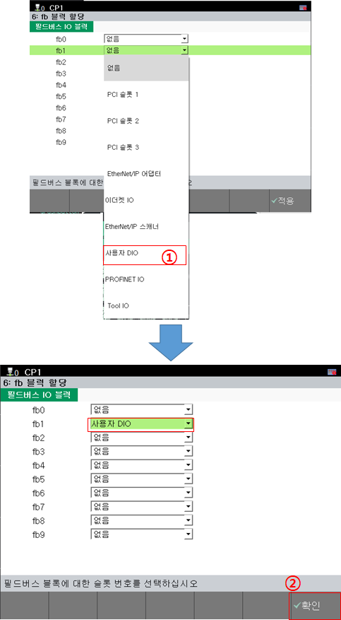
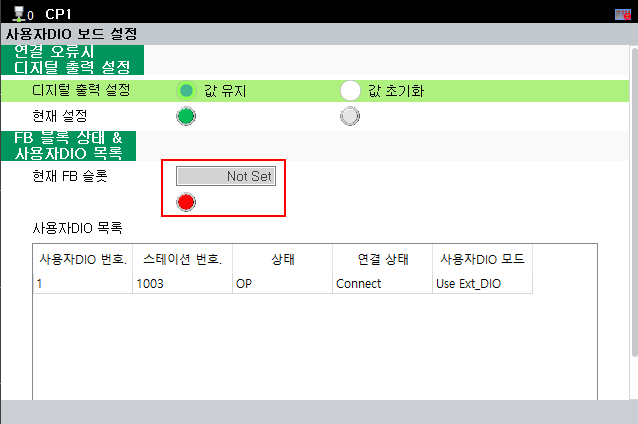
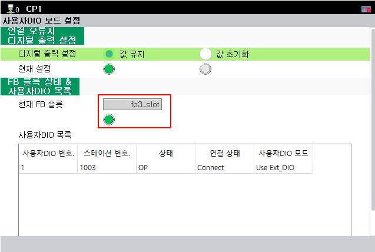
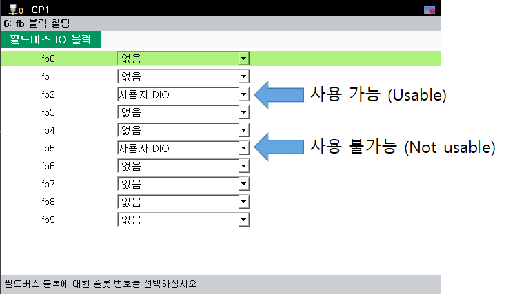

# 3.3. FB 블럭 설정

FB 블럭 설정은 다음 메뉴에서 진행할 수 있습니다.

**- 메뉴 위치: [system] - [2:Control parameter] - [2:Input/Output signal setting] - [6:fb block allocation]**

 
<그림 1. FB 블럭 할당 메뉴>  

할당하고 싶은 fb 블럭을 선택하여 '사용자 DIO'로 설정을 진행하면 됩니다.

 
<그림 2. fb1에 사용자DIO 할당 예시>  

자세한 사항은 "[로봇제어기 조작설명서 - (FB 블록 할당)](https://hrbook-hrc.web.app/#/view/doc-hi6-operation/korean-tp630/7-system/3-control-parameter/2-io-signal-setting/9-dio-block-assign)" 을 참고하시기 바랍니다.

사용자 DIO에 대한 FB블럭이 할당 되었는지는 [6:fb블럭 할당] 및 [사용자DIO 보드 설정] 메뉴에서 확인 가능합니다.

 
<그림 3. 사용자DIO FB블록 미할당>  

 
<그림 4. 사용자DIO fb3 할당> 


사용자DIO를 여러 FB블럭에 할당하여도 <strong>가장 번호가 낮은 FB블럭에서 사용 가능하며, 나머지 할당된 FB블럭은 제어가 무시</strong> 됩니다.


아래 그림과 같이 FB블럭이 할당 되었을 경우, fb2에서 사용자 DIO 제어가 가능하며, fb5에 입력된 값은 무시됩니다.

 
<그림 5. 사용자DIO fb 다중 할당 예시> 
