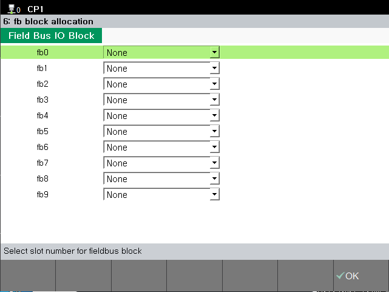
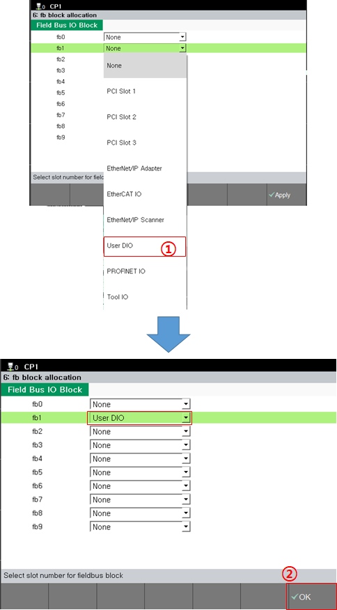
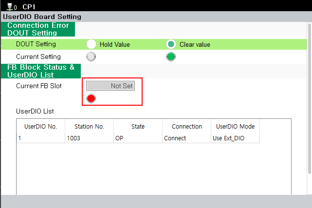
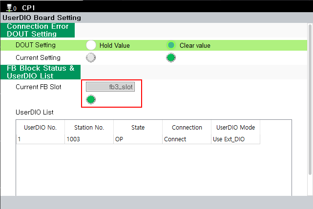
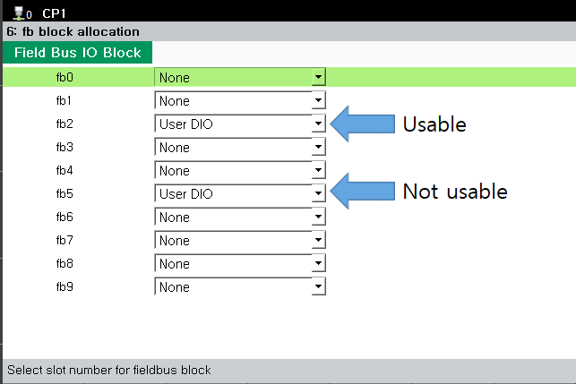

# 3.3. FB block Configuration

FB block settings can be configured in the following menu.

**- The location of the menu: [system] - [2:Control parameter] - [2:Input/Output signal setting] - [6:fb block allocation]**

 
< Figure 1. FB block allocation menu>  

Select the FB block you want to assign and configure it as "User DIO".

 
< Figure 2. Example of User DIO Assigned to FB1>  

For more details, refer to "[Robot Controller Operation Manual - (FB Block Allocation)](https://hrbook-hrc.web.app/#/view/doc-hi6-operation/en-tp630/7-system/3-control-parameter/2-io-signal-setting/9-dio-block-assign)".

Whether an FB block has been assigned to the User DIO can be checked in the [6: FB block allocation] and [UserDIO Board Setting] menus.

 
< Figure 3. User DIO FB Block Not Assigned>  

 
< Figure 4. User DIO Assigned to FB3> 


Even if the User DIO is assigned to multiple FB blocks, it is only available in the FB block with the lowest number, and the control signals from the other assigned FB blocks will be ignored.


As shown in the figure below, when the FB blocks are assigned, User DIO control is available from FB2, while the parameter values entered in FB5 are ignored.

 
< Figure 5. Example of Multiple FB Assignments for User DIO> 
