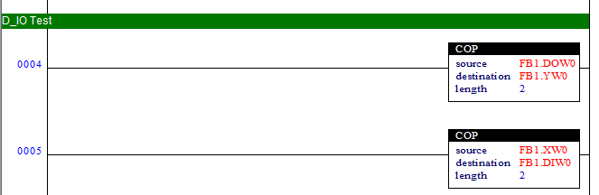

# 3.4. 内置PLC设置确认

要使用FB块来正常联动用户DIO，就需要确认内置PLC设置。

**- 内置PLC off（未使用）** 

机器人控制器的逻辑输出（Logical Output）FB0.DO0~FB9.DO959会自动输出（bypass）到物理输出（Physical Output）FB0.Y0~FB9.Y959，而物理输入FB0.X0~FB9.X959会自动输入到逻辑输入FB0.DI0~FB9.DI595，可正常使用用户DIO。  

**- 使用内置PLC**

由内置PLC加载的梯形逻辑（Ladder Logic）会影响FB块输入输出，因此需要注意。

 
<图1. 梯形逻辑的fb1逻辑/物理输入输出连接示例> 

关于内置PLC的详细内容，请参考“[机器人控制器功能说明书 - 内置PLC](https://hrbook-hrc.web.app/#/view/doc-hi6-embedded-plc/korean/README)”。
