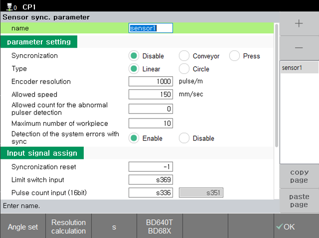
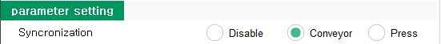
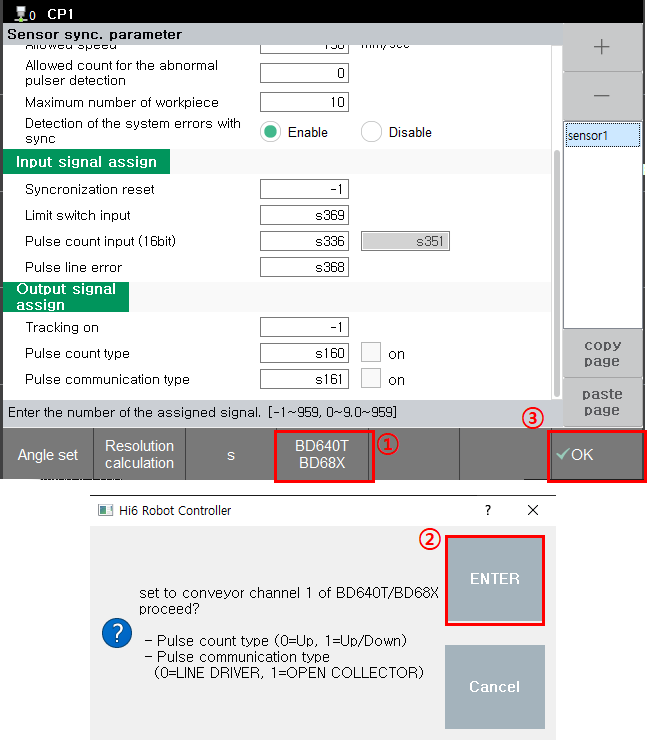
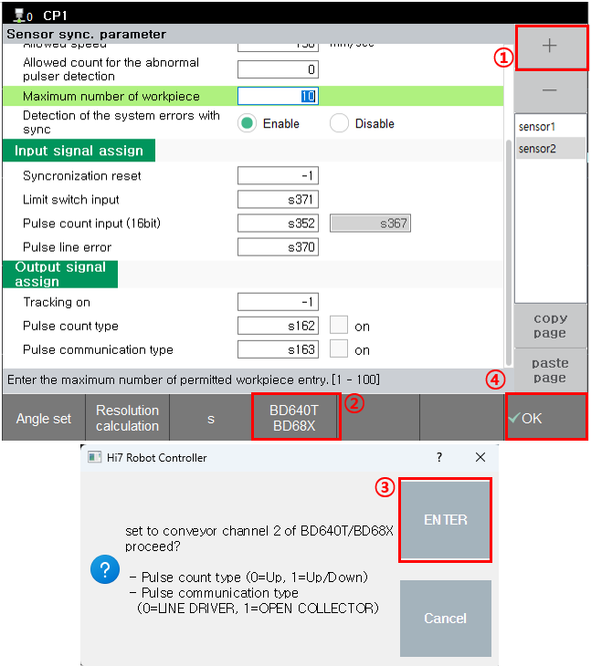
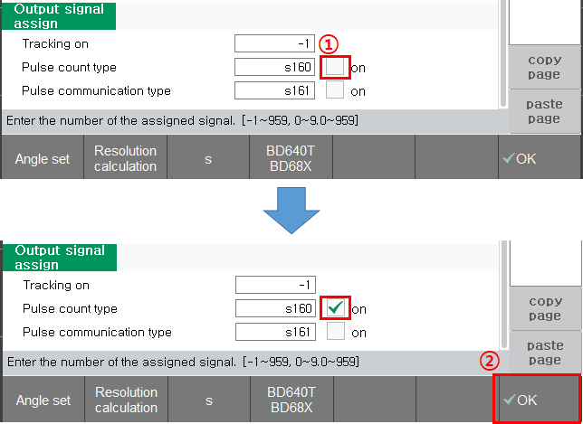

# 3.5. Sensor Synchronization Configuration


If the conveyor encoder interface is not used, the "Sensor Synchronization" setting does not need to be configured.


When using the conveyor encoder interface of BD682, the "Sensor Synchronization" setting is required.

**- The location of the menu: [system] - [4: Application parameter] - [4: Sensor synchronization]**

 
< Figure 1. Sensor Synchronization Configuration UI>  

To use the conveyor encoder interface, set the "Synchronization" item in "Parameter Setting" to "Conveyor" and configure both "Input Signal Assign" and "Output Signal Assign" properly.

 
< Figure 2. Set to Conveyor> 

For more details on the "parameter setting", refer to "[Robot Controller Function Manual - Sensor Synchronization (parameter setting)](https://hrbook-hrc.web.app/#/view/doc-sensor-sync/korean/3-user-interface/3-3-sensor-sync-parameter)".

 
Since the conveyor interface of BD682 is linked to the system I/O, input and output signal assignment is required.

As shown in the figure below, press the **[BD640T BD68X] button** located under the UI to enter the specified I/O number. Finally, press the **[v OK] button** to apply the settings.

 
< Figure 3. Channel 1 System I/O Configuration>  

 
< Figure 4. Channel 2 System I/O Configuration>  

Additionally, you can select the "Pulse count type" and the "Pulse communication type" (encoder type). Please refer to the table below for details.
 

< Table 1. Pulse Count Type and Pulse Communication Type (Encoder Type) Information>

<table>
<thead>
    <tr>
        <th style="width: 20px; text-align: center;">
            No.
        </th>
        <th style="width: 200px; text-align: center;">
            Output Signal Assignment
        </th>
        <th style="width: 30px; text-align: center;">
            ON/OFF
        </th>
        <th style="width: 250px; text-align: center;">
            Note
        </th>
    </tr>
</thead>
<tbody>
    <tr>
        <td rowspan="2" style="text-align: center;">
            <strong>1</strong>
        </td>
        <td rowspan="2" style="text-align: center;">
            Pulse Count Type
        </td>
        <td style="text-align: center;">
            ON (1)
        </td>
        <td> 
            Up / Down Count method
        </td>
    </tr>        
        <td style="text-align: center;">
            OFF (0)
        </td>
        <td> 
            Up Count method (Default)
        </td>
    </tr>
        <tr>
        <td rowspan="2" style="text-align: center;">
            <strong>2</strong>
        </td>
        <td rowspan="2" style="text-align: center;">
            Pulse Communication Type 
            (Encoder Type)
        </td>
        <td style="text-align: center;">
            ON (1)
        </td>
        <td> 
            Open Collector Type Encoder
        </td>
    </tr>        
        <td style="text-align: center;">
            OFF (0)
        </td>
        <td> 
            Line Driver Type Encoder (Default)
        </td>
    </tr>
</tbody>
</table>

 

As shown in the figure below, you can set it to ON by clicking the checkbox. 
To apply the setting, be sure to press the **[v OK] button**.

 
< Figure 5. Pulse Count Type ON Applied> 

For detailed information, refer to the conveyor-related section of "[Robot Controller Function Manual - Sensor Synchronization](https://hrbook-hrc.web.app/#/view/doc-sensor-sync/korean/README)".
