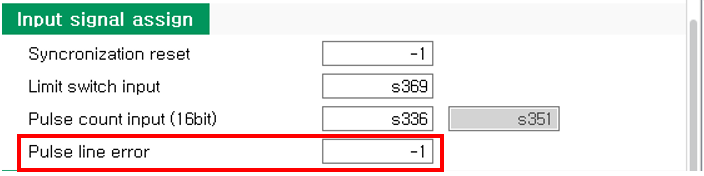

# 3.5. 传感器同步配置


如果不使用输送机编码器接口，则无需配置“传感器同步”设置。


在使用 BD682 的输送机编码器接口时，需配置“传感器同步”设置。

**- 菜单位置: [system] - [4: 应用参数] - [4: 传感器同步]**

 
< Figure 1. 传感器同步配置 UI>  

要使用输送机编码器接口，请在“参数设置”中将“同步”项目设置为“输送机”，并正确配置“输入信号分配”和“输出信号分配”。

 
< Figure 2. 设置为输送机> 

有关“参数设置”的更多详细信息，请参阅“[机器人控制器功能手册 - 传感器同步（参数设置）](https://hrbook-hrc.web.app/#/view/doc-sensor-sync/zh/3-user-interface/3-3-sensor-sync-parameter?cont_model=Hi7)”。

 
由于 BD682 的输送机接口与系统 I/O 连接，因此需要进行输入和输出信号分配。

如下图所示，按下 UI 下方的 **[BD640T BD68X] 按钮** 以输入指定的 I/O 编号。最后，按下 **[v OK] 按钮** 以应用设置。

 
< Figure 3. 通道 1 系统 I/O 配置>  

 
< Figure 4. 通道 2 系统 I/O 配置>  

此外，您可以选择“脉冲计数类型”和“脉冲通信类型”（编码器类型）。有关详细信息，请参考下表。
 

< Table 1. 脉冲计数类型和脉冲通信类型（编码器类型）信息>

<table>
<thead>
    <tr>
        <th style="width: 20px; text-align: center;">
            No.
        </th>
        <th style="width: 200px; text-align: center;">
            输出信号分配
        </th>
        <th style="width: 30px; text-align: center;">
            ON/OFF
        </th>
        <th style="width: 250px; text-align: center;">
            备注
        </th>
    </tr>
</thead>
<tbody>
    <tr>
        <td rowspan="2" style="text-align: center;">
            <strong>1</strong>
        </td>
        <td rowspan="2" style="text-align: center;">
            脉冲计数类型
        </td>
        <td style="text-align: center;">
            ON (1)
        </td>
        <td> 
            上/下计数方法
        </td>
    </tr>        
        <td style="text-align: center;">
            OFF (0)
        </td>
        <td> 
            上计数方法（默认）
        </td>
    </tr>
        <tr>
        <td rowspan="2" style="text-align: center;">
            <strong>2</strong>
        </td>
        <td rowspan="2" style="text-align: center;">
            脉冲通信类型 
            （编码器类型）
        </td>
        <td style="text-align: center;">
            ON (1)
        </td>
        <td> 
            开集电极类型编码器
        </td>
    </tr>        
        <td style="text-align: center;">
            OFF (0)
        </td>
        <td> 
            线路驱动类型编码器（默认）
        </td>
    </tr>
</tbody>
</table>

 

如下图所示，您可以通过单击复选框将其设置为 ON。 
要应用设置，请务必按下 **[v OK] 按钮**。

 
< Figure 5. 脉冲计数类型 ON 应用> 


使用开集电极类型编码器时，“脉冲线错误”功能不可用。 
因此，您必须在“输入信号分配”中将“脉冲线错误”设置为“-1（未使用）”。



使用开集电极类型编码器时，如果不将“脉冲线错误”设置为“-1（未使用）”，则在控制器重启时可能会发生错误 E27001（输送机脉冲线异常）。


 
< Figure 6. 开集电极类型编码器脉冲线错误设置> 

有关详细信息，请参阅“[机器人控制器功能手册 - 传感器同步](https://hrbook-hrc.web.app/#/view/doc-sensor-sync/zh/README?cont_model=Hi7)”的输送机相关部分。