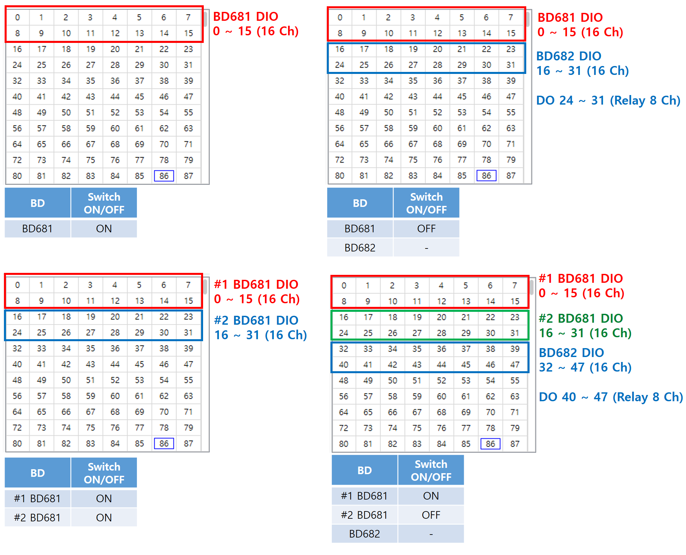
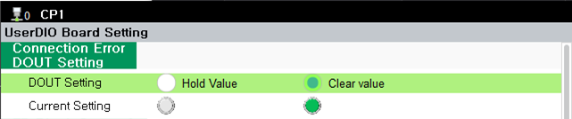
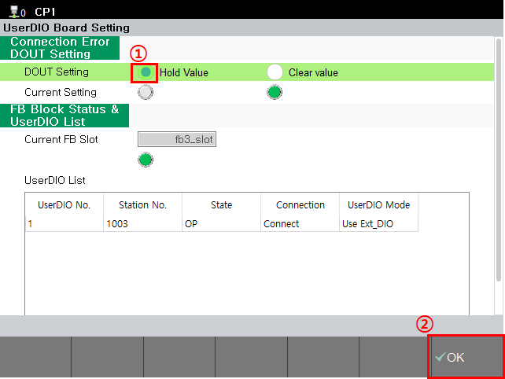

# 4.1. 如何使用 DIO

如果电缆正确连接到 BD681 和 BD682 的连接器，请参阅以下指令以控制数字输入和输出。
 

<mark style="color:green;">**- 与控制器输入/输出信号的连接**</mark>

有关控制器 I/O 信号与板 I/O 之间的连接的详细信息，请参阅 "[Robot Controller Operation Manual - (Input/Output Signal Setting)](https://hrbook-hrc.web.app/#/view/doc-hi6-operation/zh-tp630/7-system/3-control-parameter/2-io-signal-setting/README?cont_model=Hi7)"。

 

<mark style="color:green;">**- 使用 TP 控制板输入/输出**</mark>

有关从 TP 控制板输出和检查输入的内容，请参阅 "[Robot Controller Operation Manual - (Public Output)](https://hrbook-hrc.web.app/#/view/doc-hi6-operation/zh-tp630/6-monitoring/2-io/4-user-output?cont_model=Hi7)" 和 "[Robot Controller Operation Manual - (Public Input)](https://hrbook-hrc.web.app/#/view/doc-hi6-operation/zh-tp630/6-monitoring/2-io/3-user-input?cont_model=Hi7)"。

 


注意，受控 I/O 范围因 BD681 和 BD682 的组合而异。


 
< Figure 1. 根据板组合的 I/O 控制范围示例> 

 

<mark style="color:green;">**- 使用 Job 控制板输入/输出**</mark>

有关在 Job 中连接板输入和输出的信息，请参阅 "[Robot Controller Function Manual - Robot Language HRScript (FB Object: Digital I/O)](https://hrbook-hrc.web.app/#/view/doc-hrscript/zh/6-external-comm/1-fb-io/README?cont_model=Hi7)"。

  
此外，用户 DIO 提供了在发生瞬时 EtherCAT 通信错误时配置数字输出状态的功能（例如，由于通信错误而转换到 Pre-OP 或 Safe-OP 状态）。

**- 菜单位置：[system] - [12: Option System] - [UserDIO Board Setting]**

 
< Figure 2. 连接错误时的数字输出设置> 

 

< Table 1. 连接错误时的数字输出设置信息>

<table>
<thead>
    <tr>
        <th style="width: 50px; text-align: center;">
            No.
        </th>
        <th style="width: 110px; text-align: center;">
            设置值
        </th>
        <th style="width: 370px; text-align: center;">
            注意
        </th>
    </tr>
</thead>
<tbody>
    <tr>
        <td style="text-align: center;">
            <strong>1</strong>
        </td>
        <td style="text-align: center;">
            清除值 
            （默认）
        </td>
        <td> 
             - 在连接错误时将所有板输出设置为 OFF
        </td>
    </tr>
    <tr>
        <td style="text-align: center;">
            <strong>2</strong>
        </td>
        <td style="text-align: center;">
            保持值
        </td>
        <td> 
             - 在连接错误时保持板输出为最后值
        </td>
    </tr>
</tbody>
</table>

 
如果要更改配置的值，请选择所需的设置，然后按 [v OK] 按钮。  

 
< Figure 3. 连接错误时数字输出设置的更改> 