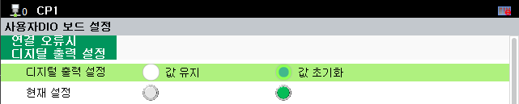
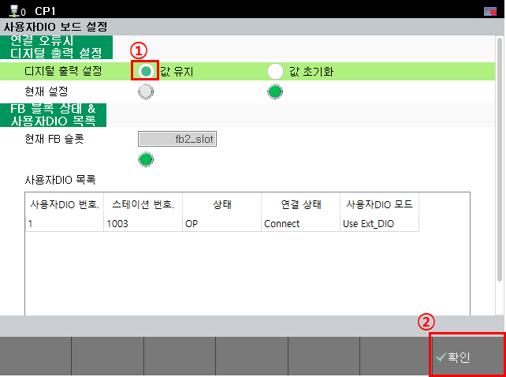

# 4.1. DIO使用方法

若正确连接至BD681、BD682的连接器电缆，关于控制数字输入输出的方法，请参考以下内容。
 

<mark style="color:green;">**- 与控制器的输入输出信号联动**</mark>

关于控制器的输入输出信号与电路板输入输出联动的内容，请参考“[机器人控制器操作说明书-（输入输出信号设置）](https://hrbook-hrc.web.app/#/view/doc-hi6-operation/korean-tp630/7-system/3-control-parameter/2-io-signal-setting/README)”。

 

<mark style="color:green;">**- 使用TP进行电路板输入、输出控制**</mark>

关于在TP上控制电路板输出并确认输入的内容，请参考“[机器人控制器操作说明书 - (通用输出)](https://hrbook-hrc.web.app/#/view/doc-hi6-operation/korean-tp630/6-monitoring/2-io/4-user-output)”、“[机器人控制器操作说明书 - (通用输入)](https://hrbook-hrc.web.app/#/view/doc-hi6-operation/korean-tp630/6-monitoring/2-io/3-user-input)”。

 

<mark style="color:green;">**- 使用Job进行电路板输入、输出控制**</mark>

关于在Job中联动电路板输入、输出的内容，请参考“[机器人控制器功能说明书 - 机器人语言HRScript (fb对象 : 数字 I/O)](https://hrbook-hrc.web.app/#/view/doc-hrscript/korean/6-external-comm/1-fb-io/README)”。

  
此外，用户DIO具备在EtherCAT通信连接瞬间发生错误时（示例：因EtherCAT通信断开等原因导致的Pre-OP、Safe-OP状态）设置数字输出状态的功能。

**- 菜单位置 : [系统] - [选配装置] - [用户DIO板设置]**

 
<图1. 连接错误时的数字输出设置> 

 

<表1. 连接错误时的数字输出设置信息>

<table>
<thead>
    <tr>
        <th style="width: 50px; text-align: center;">
            No.
        </th>
        <th style="width: 110px; text-align: center;">
            设定值
        </th>
        <th style="width: 370px; text-align: center;">
            备注
        </th>
    </tr>
</thead>
<tbody>
    <tr>
        <td style="text-align: center;">
            <strong>1</strong>
        </td>
        <td style="text-align: center;">
            值初始化 
            （默认设定值）
        </td>
        <td> 
             - 当发生连接错误时，则将电路板输出值全部改为OFF。
        </td>
    </tr>
    <tr>
        <td style="text-align: center;">
            <strong>2</strong>
        </td>
        <td style="text-align: center;">
            保持数值
        </td>
        <td> 
             - 当发生连接错误时，则将电路板输出值保持为前一个值。
        </td>
    </tr>
</tbody>
</table>

 
要更改设定值，请选择所需设定值后，按下[v确认]按钮。  

 
<图2. 更改连接错误时的数字输出设定值> 

